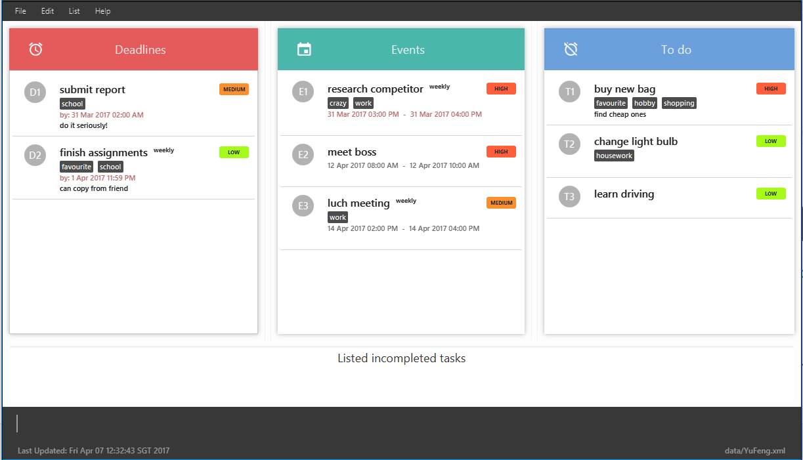

# OneTwoDo

 

Having trouble keeping track with the tasks you have to complete? Looking for a simple yet effective task manager to help you organise your day? OneTwoDo is what you are looking for.

OneTwoDo has a simple and clean interface. It clearly displays 3 categories of tasks, namely events, deadlines and to-do's.

OneTwoDo is specially designed to be keyboard-friendly. By just typing one line of command, OneTwoDo will faithfully execute your wish. No extra buttons needed to click!

Get started with OneTwoDo today!

OneTwoDo also supports the following for developers:
* Automated GUI testing.
* Support for *Build Automation* using Gradle and for *Continuous Integration* using Travis CI.

#### Site Map
* [User Guide](https://cs2103jan2017-f14-b1.github.io/main/UserGuide.pdf)
* [Developer Guide](https://cs2103jan2017-f14-b1.github.io/main/DeveloperGuide.pdf)
* [Learning Outcomes](docs/LearningOutcomes.md)
* [About Us](docs/AboutUs.md)
* [Contact Us](docs/ContactUs.md)

#### Acknowledgements

* Some parts of this sample application were inspired by the excellent
  [Java FX tutorial](http://code.makery.ch/library/javafx-8-tutorial/) by *Marco Jakob*.
* This application is based on [AddressBook Level 4's](https://github.com/nus-cs2103-AY1617S2/addressbook-level4/) sample code.

#### Licence : [MIT](LICENSE)
