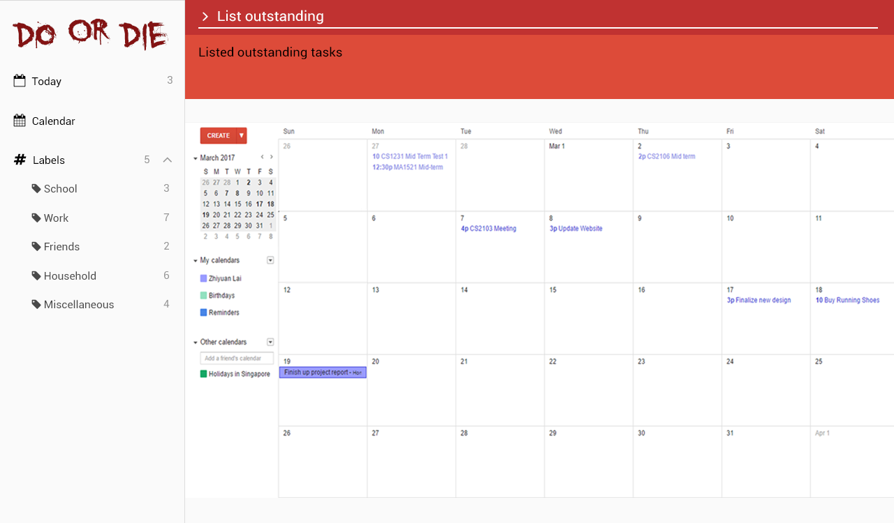

#  DoOrDie Task Manager

  
  
  

* This is a desktop task manager application. It has a GUI but most of the user interactions happen using
  a CLI (Command Line Interface).
* It is a Java application intended for users to manage and keep track of tasks on hand.
* It is **written in OOP fashion**. It provides a **reasonably well-written** code example that is
  **significantly bigger** (around 12 KLoC).
* Support for *Build Automation* using Gradle and for *Continuous Integration* using Travis CI.

#### Site Map
* [User Guide](docs/UserGuide.md)
* [Developer Guide](docs/DeveloperGuide.md)
* [Learning Outcomes](docs/LearningOutcomes.md)
* [About Us](docs/AboutUs.md)
* [Contact Us](docs/ContactUs.md)

#### Acknowledgements

* Some parts of this sample application were inspired by the excellent [Java FX tutorial](http://code.makery.ch/library/javafx-8-tutorial/) by *Marco Jakob*.
* The sample project created by [SE-EDU](https://github.com/se-edu/) initiative.

#### External Libraries

* [Natty](http://natty.joestelmach.com/) by joestelmach - A framework to parse relative dates into absolute dates
* [itextPDF](http://itextpdf.com/) by iText Software - For exporting data to PDF files
* [FontAwesomeFX](https://bintray.com/jerady/maven/FontAwesomeFX) by Jens Deters - For icons used in the GUI

#### Licence : [MIT](LICENSE)
