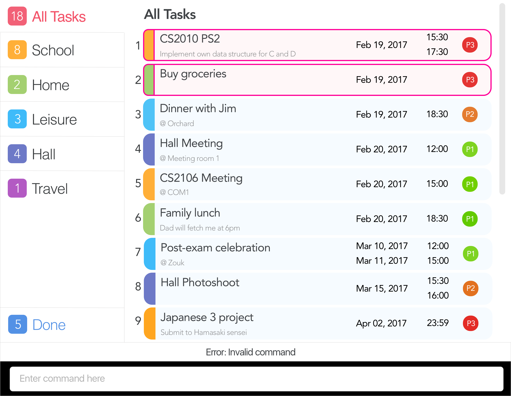

# TaskBoss

 

This is a desktop task manager application. 
It has a GUI but most of the user interactions happen using a CLI (Command Line Interface).

#### Site Map
* [User Guide](docs/UserGuide.md)
* [Developer Guide](docs/DeveloperGuide.md)
* [Learning Outcomes](docs/LearningOutcomes.md)
* [About Us](docs/AboutUs.md)
* [Contact Us](docs/ContactUs.md)

#### Acknowledgements

* The original source of this code was used from the sample project created by [SE-EDU initiative](https://github.com/se-edu/addressbook-level4).
* Some parts of TaskBoss were inspired by the excellent
  [Java FX tutorial](http://code.makery.ch/library/javafx-8-tutorial/) by *Marco Jakob*.
* [Natty](http://natty.joestelmach.com/) date parser by *Joe Stelmach*. 
  

#### Licence : [MIT](LICENSE)
