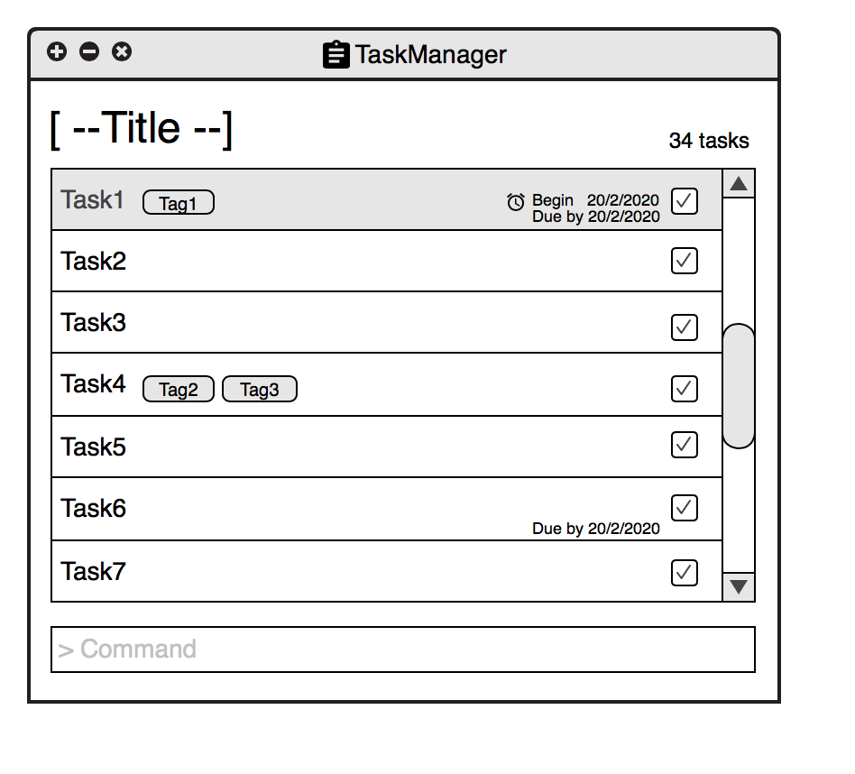

# Tdoay

 
**Today** is a minimalistic task manager that aims to be the simplest way to organize your day.

In our far too hectic lives, there's just so much to keep track of. Trying to manage everything is a tiring and stressful affair. Instead of overwhelming you with a neverending task list, **Today** helps you focus on the things that you *can* control - the tasks you're going to tackle today.

This user guide is here to guide you through the [installation](#installation-instructions) of our application and give you a walkthrough of our [basic features](#features). We've also provided a [cheatsheet](#command-summary) with a summary of all our commands available.

### Quick Start
Let's get you up and running.

1. Install the latest Java [here](https://java.com/en/download/). This will be required to run the application.
2. Download `today.jar` from the [releases](../../../releases) tab.
3. Copy the file to the folder you want to use as the home folder for your task manager.
4. Double-click the file to start the app and you are ready to go.

#### Site Map
* [User Guide](docs/UserGuide.md)
* [Developer Guide](docs/DeveloperGuide.md)
* [Learning Outcomes](docs/LearningOutcomes.md)
* [About Us](docs/AboutUs.md)
* [Contact Us](docs/ContactUs.md)

#### Acknowledgements

* The project is developed based on FOSS's Software Engineering Education Resource.
  [se-edu-taskmanager-level4](https://github.com/se-edu/taskmanager-level4)

* Some parts of this sample application were inspired by the excellent
  [Java FX tutorial](http://code.makery.ch/library/javafx-8-tutorial/) by *Marco Jakob*.

#### Licence : [MIT](LICENSE)
