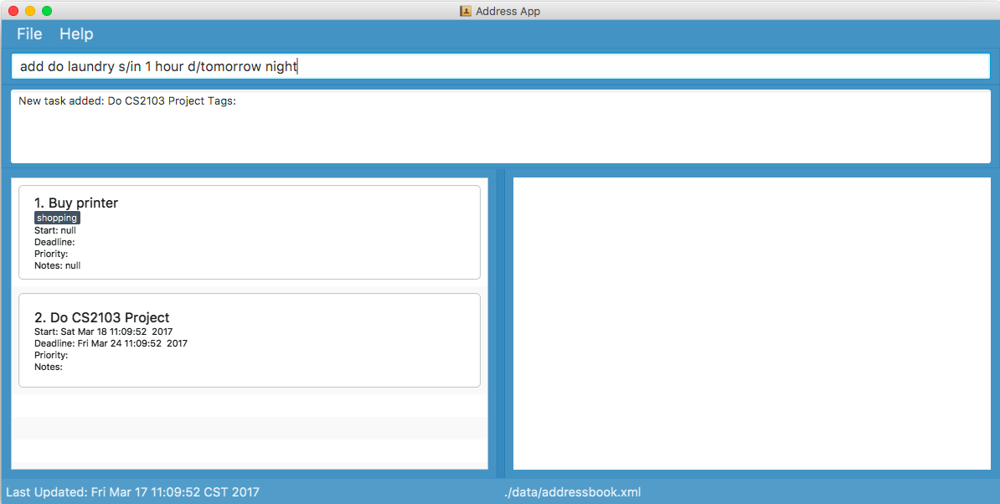

# ToDoApp

 

* This is a desktop To-Do-List application. It has a GUI but most of the user interactions happen using
  a CLI (Command Line Interface).
* It is a Java sample application intended for students learning Software Engineering while using Java as
  the main programming language.
* This has been adapted and refactored from [addressbook-level4](https://github.com/nus-cs2103-AY1617S2/addressbook-level4) to fit the requirements of a To-Do-List application.
* It is **written in OOP fashion**. It provides a **reasonably well-written** code example that is
  **significantly bigger** (around 6 KLoC)than what students usually write in beginner-level SE modules.

#### Site Map
* [User Guide](docs/UserGuide.md)
* [Developer Guide](docs/DeveloperGuide.md)
* [About Us](docs/AboutUs.md)
* [Contact Us](docs/ContactUs.md)

#### Acknowledgements

* Some parts of this sample application were inspired by the excellent
  [Java FX tutorial](http://code.makery.ch/library/javafx-8-tutorial/) by *Marco Jakob*.
* The sample project was forked from `https://github.com/nus-cs2103-AY1617S2/addressbook-level4`, created by SE-EDU initiative at `https://github.com/se-edu/`

#### Licence : [MIT](LICENSE)
