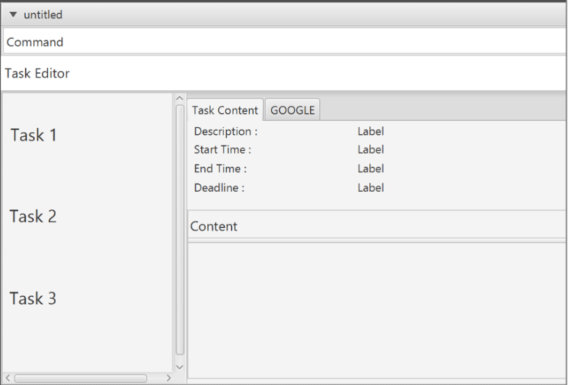

# myPotato

 
* This is a desktop Address Book application. It has a GUI but most of the user interactions happen using
  a CLI (Command Line Interface).
* It is a Java application intended for people to organize their tasks.
* Find out how to install and use myPotato by reading the UserGuide file, docs/UserGuide.md.  

#### Site Map
* [User Guide](docs/UserGuide.md)
* [Developer Guide](docs/DeveloperGuide.md)
* [Learning Outcomes](docs/LearningOutcomes.md)
* [About Us](docs/AboutUs.md)
* [Contact Us](docs/ContactUs.md)

#### Acknowledgements

* Some parts of this application were inspired by the excellent
  [Java FX tutorial](http://code.makery.ch/library/javafx-8-tutorial/) by *Marco Jakob*.
* This application is based on the sample code from
  [AddressBook Level 4](https://github.com/se-edu/) by *SE-EDU*. 

#### Licence : [MIT](LICENSE)
