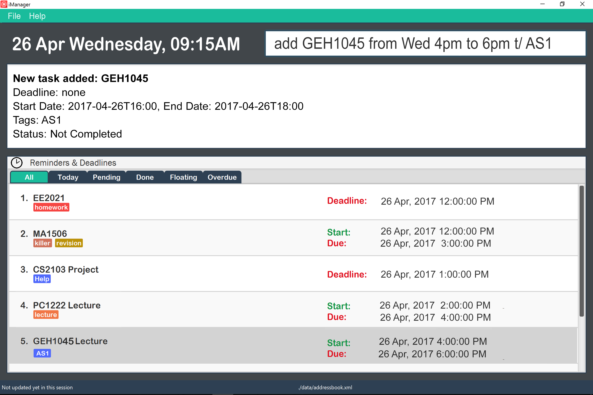

# Task Manager  (Level 5)

 
Best task manager EVER!

#### Site Map
* [User Guide](docs/UserGuide.md)
* [Developer Guide](docs/DeveloperGuide.md)
* [Learning Outcomes](docs/LearningOutcomes.md)
* [About Us](docs/AboutUs.md)
* [Contact Us](docs/ContactUs.md)

#### Acknowledgements

* The project is developed based on FOSS's Software Engineering Education Resource.
  [se-edu-taskmanager-level4](https://github.com/se-edu/taskmanager-level4)
  
* Some parts of this sample application were inspired by the excellent
  [Java FX tutorial](http://code.makery.ch/library/javafx-8-tutorial/) by *Marco Jakob*.

#### Licence : [MIT](LICENSE)
