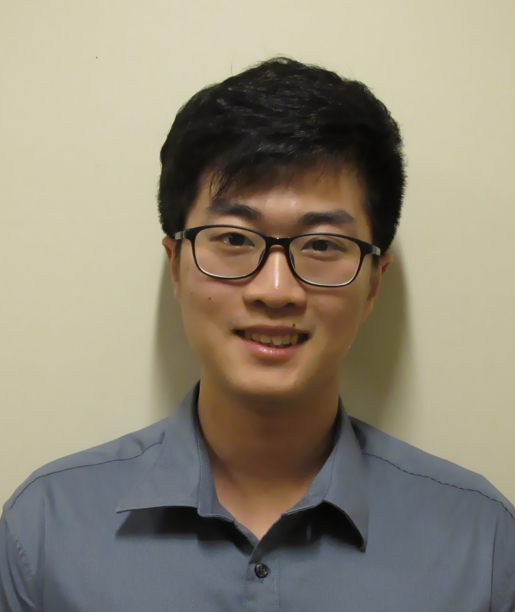

# About Us

We are a team based in the [School of Computing, National University of Singapore](http://www.comp.nus.edu.sg).

## Project Team

#### Li Zihan [@lizihan97](https://github.com/lizihan97)  
 
* Component in charge of: [Model](https://github.com/CS2103JAN2017-W10-B4/main/blob/master/docs/DeveloperGuide.md#24-model-component) 
* Aspects/tools in charge of: Code Quality, Documentation 
* Features implemented: 

  * Show sorted event and task lists
  * Jump to the lastly changed event/task after adding and editing
  * Jump to the first event/task after listing
* Code written:
* Other major contributions:
  * Refactored AddressBook to WhatsLeft
  * Refactored Person to Activity
  * Refactored UI package
  * Refactored test package

-----

#### Goh Yue Quan [@blakegoh](http://github.com/blakegoh)
 
* Component in charge of: [GUI](https://github.com/CS2103JAN2017-W10-B4/main/blob/master/docs/DeveloperGuide.md#22-ui-component) 
* Aspects/tools in charge of: Deliverables and deadline 
* Features implemented: 

  * Implemented a calendar in UI
* Code written:
* Other major contributions:
  * Refactored UI package
  * Implemented UI layout

-----

#### Shannon Yong Jing Shun [@gillro](http://github.com/gillro)
 
* Component in charge of: [Logic](https://github.com/CS2103JAN2017-W10-B4/main/blob/master/docs/DeveloperGuide.md#23-logic-component) 
* Aspects/tools in charge of: Integration, Scheduling and tracking 
* Features implemented: 

  * [Add event and task](https://github.com/CS2103JAN2017-W10-B4/main/blob/master/docs/UserGuide.md#22-adding-an-eventtask--add)
  * [Edit event and task](https://github.com/CS2103JAN2017-W10-B4/main/blob/master/docs/UserGuide.md#24-editing-an-eventtask--edit)
  * [Delete event and task](https://github.com/CS2103JAN2017-W10-B4/main/blob/master/docs/UserGuide.md#27-deleting-an-eventtask--delete)
  * [Select event and task](https://github.com/CS2103JAN2017-W10-B4/main/blob/master/docs/UserGuide.md#26-selecting-an-eventtask--select)
* Code written:
* Other major contributions:
  * Travis setting up
  * Fixed GUI testing

-----

#### Li Chengcheng [@AndyLee13](http://github.com/AndyLee13)
 
* Component in charge of: [Storage](https://github.com/CS2103JAN2017-W10-B4/main/blob/master/docs/DeveloperGuide.md#25-storage-component), [Commons](https://github.com/CS2103JAN2017-W10-B4/main/blob/master/docs/DeveloperGuide.md#26-common-classes) 
* Aspects/tools in charge of: Testing 
* Features implemented: 

  * [Finish task](https://github.com/CS2103JAN2017-W10-B4/main/blob/master/docs/UserGuide.md#29-finishing-a-task-finish)
  * [Show completed/pending/all tasks](https://github.com/CS2103JAN2017-W10-B4/main/blob/master/docs/UserGuide.md#210-task-display-preference-show)
  * [Redo task](https://github.com/CS2103JAN2017-W10-B4/main/blob/master/docs/UserGuide.md#212-redoing-the-completed-task--redo)
  * [Save/Read WhatsLeft from another folder]
* Code written:
* Other major contributions:
  * Fixed GUI testing
  * Added start-end constraint for Event

 -----

# Contributors

We welcome contributions. See [Contact Us](ContactUs.md) page for more info.
