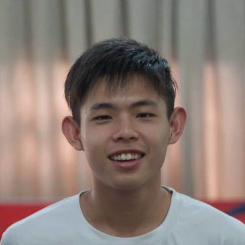
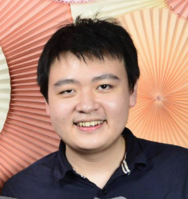

# About Us

We are a team based in the [School of Computing, National University of Singapore](http://www.comp.nus.edu.sg).

## Project Team

#### [Louis Lai](http://github.com/louislai)
 
Role: Team Leader  

* Components in charge of: UI, Model, Storage
* Aspects/tools in charge of: Scheduling and tracking, CI, Code quality
* Features implemented:
  - Mark complete/incomplete single/multiple tasks
  - Undo/Redo single/multiple times
  - Alias/Unalias/View Alias commands
  - Change storage commands
  - Most of the GUI including the different tab filter + Switch command
* Code written:
* Other major contributions:
  - Designed the MVC architecture for back-end
  - Designed the reactive architecture for front-end
  - Set up CI for the project
  - Set up GUI test infrastructure for the project

-----

#### [Melvin Tan](http://github.com/Melvin-Tan)
 
Role: Developer  

* Components in charge of: Task, Event, Tokenizer
* Aspects/tools in charge of: Testing, Eclipse, Natty
* Features implemented:
    - CRUD for all types of tasks (including floating task, task with deadline, event, recurring task)
    - Delete multiple tasks
* Code written:
* Other major contributions:
    - Wrote most of the re-usable Tokenizer/Parser classes to be used by various Controllers
    - Put in validation for most of the model
    - Heavily involved in peer-reviewing most of the PR

-----

#### [Lewis Koh](http://github.com/Rinder5)
 
Role: Developer  

* Components in charge of: Tag, Search/Filter
* Aspects/tools in charge of: Documentation
* Feature implented:
  - Tag/Untag commands
  - Find/Filter/List command
  - Clear command
  - History command
  - Hot key up & down to navigate command history
* Code written:
* Other major contribution:
  - Regularly update the project manual
