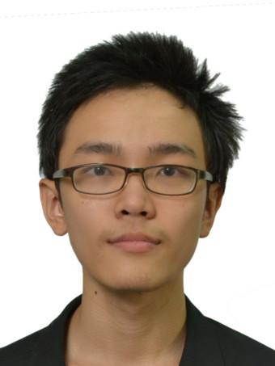
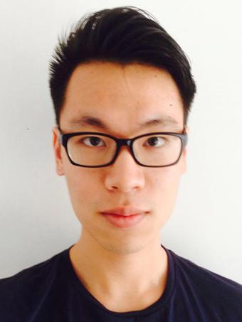

# About Us

We are a team based in the [School of Computing, National University of Singapore](http://www.comp.nus.edu.sg).

## Project Team

#### [Liu Ziyang](http://github.com/VeryLazyBoy)
 
Role: Developer  
Responsibilities: UI

-----

#### [How Si Wei](http://github.com/howsiwei)
 
Role: Developer  
Responsibilities: UI

-----

#### [Goh Yi Rui](http://github.com/yirui94)
 
Role: Developer  
Responsibilities: Data

-----

#### [Zhang Hanming](https://github.com/ZhangHanming)
 
 Role: Developer  
 Responsibilities: Data

 -----

# Contributors

We welcome contributions. See [Contact Us](ContactUs.md) page for more info.

* [Akshay Narayan](https://github.com/se-edu/addressbook-level4/pulls?q=is%3Apr+author%3Aokkhoy)
* [Sam Yong](https://github.com/se-edu/addressbook-level4/pulls?q=is%3Apr+author%3Amauris)
