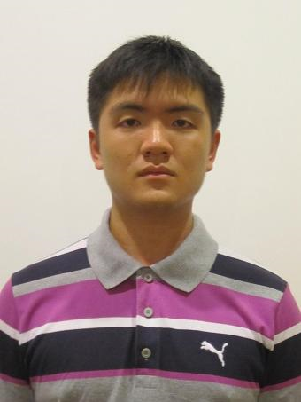

# About Us

We are a team based in the [School of Computing, National University of Singapore](http://www.comp.nus.edu.sg).

## Project Team

#### [Andrew Sugiarto](https://github.com/azraelos)  
 

* **Components in charge of:** [Model](https://github.com/CS2103JAN2017-T16-B3/main/blob/master/docs/DeveloperGuide.md#24-model-component) 
* **Aspects/tools in charge of:** Code quality  
* **Features implemented:**  
   * [List tasks](https://github.com/CS2103JAN2017-T16-B3/main/blob/master/docs/UserGuide.md#23-listing-tasks-by-type--list-list_type) 
   * [Edit tags](https://github.com/CS2103JAN2017-T16-B3/main/blob/master/docs/UserGuide.md#25-editing-a-task--edit) 
* **Code written**: [[functional code](A0139872R.md)][[test code](A0139872R.md)] 
* **Other major contributions:**  

-----

#### [Ching Hui Qi](http://github.com/hqching)
 

* **Components in charge of:** [Logic](https://github.com/CS2103JAN2017-T16-B3/main/blob/master/docs/DeveloperGuide.md#23-logic-component) 
* **Aspects/tools in charge of:** Scheduling and tracking  
* **Features implemented:**  
   * [Add task](https://github.com/CS2103JAN2017-T16-B3/main/blob/master/docs/UserGuide.md#22-adding-a-task--add) 
   * [Edit task](https://github.com/CS2103JAN2017-T16-B3/main/blob/master/docs/UserGuide.md#25-editing-a-task--edit) 
   * [Alternative commands](https://github.com/CS2103JAN2017-T16-B3/main/blob/master/docs/UserGuide.md#215-alternative-commands) 
   * [Customize alternative commands](https://github.com/CS2103JAN2017-T16-B3/main/blob/master/docs/UserGuide.md#216-customize-alternative-commands-shortcut) 
* **Code written**: [[functional code](A0143076J.md)][[test code](A0143076J.md)] 
* **Other major contributions:**  

-----

#### [Megan Quek](http://github.com/megan-quek)
 

* **Components in charge of:** [Storage](https://github.com/CS2103JAN2017-T16-B3/main/blob/master/docs/DeveloperGuide.md#25-storage-component) 
* **Aspects/tools in charge of:** Documentation, Testing  
* **Features implemented:**  
   * [Delete task(s)](https://github.com/CS2103JAN2017-T16-B3/main/blob/master/docs/UserGuide.md#26-deleting-a-task--delete) 
   * [Mark task(s)](https://github.com/CS2103JAN2017-T16-B3/main/blob/master/docs/UserGuide.md#27-mark-a-task--mark) 
   * [Unmark task(s)](https://github.com/CS2103JAN2017-T16-B3/main/blob/master/docs/UserGuide.md#28-unmark-a-task--unmark) 
   * [Import storage file](https://github.com/CS2103JAN2017-T16-B3/main/blob/master/docs/UserGuide.md#212-load-data-from-a-specified-file--import) 
   * [Change storage file location](https://github.com/CS2103JAN2017-T16-B3/main/blob/master/docs/UserGuide.md#213-change-storage-file-location--saveas) 
   * [View current storage file location](https://github.com/CS2103JAN2017-T16-B3/main/blob/master/docs/UserGuide.md#214-view-current-storage-file-location--viewfile) 
* **Code written**: [[functional code](A0141077L.md)][[test code](A0141077L.md)] 
* **Other major contributions:**  

-----

#### [Mervyn Yee](http://github.com/mervynyeezl)
 

* **Components in charge of:** [UI](https://github.com/CS2103JAN2017-T16-B3/main/blob/master/docs/DeveloperGuide.md#22-ui-component) 
* **Aspects/tools in charge of:** Team lead, Deliverables and deadlines, Integration  
* **Features implemented:**  
   * [Undo](https://github.com/CS2103JAN2017-T16-B3/main/blob/master/docs/UserGuide.md#29-undoing-previous-step--undo) 
   * [Redo](https://github.com/CS2103JAN2017-T16-B3/main/blob/master/docs/UserGuide.md#210-redoing-previous-step--redo) 
* **Code written**: [[functional code](A0139845R.md)][[test code](A0139845R.md)] 
* **Other major contributions:**  

-----

# Other Major Contributors
#### [Henry Chia](http://github.com/hwkchia)
Role: Lecturer  

-----

#### [Soo Yuen Jien](http://github.com/sooyj)
Role: Lecturer and tutor  

-----

#### [Akshay Narayan](http://github.com/okkhoy)
Role: Tutor  

-----

#### [Brandon Yeo](http://github.com/brandonyeoxg)
Role: Tutor  

-----

#### [Joel Tan](http://github.com/JoelT-92)
Role: Tutor  

-----

# Contributors

We welcome contributions. See [Contact Us](ContactUs.md) page for more info.

* [Akshay Narayan](https://github.com/se-edu/addressbook-level4/pulls?q=is%3Apr+author%3Aokkhoy)
* [Sam Yong](https://github.com/se-edu/addressbook-level4/pulls?q=is%3Apr+author%3Amauris)
