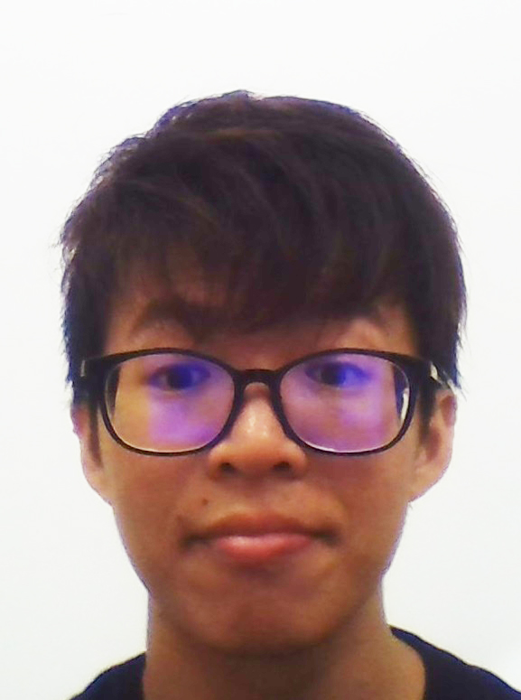
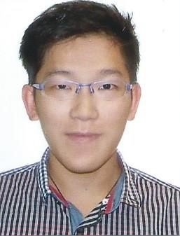
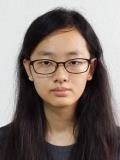

# About Us

We are a team based in the [School of Computing, National University of Singapore](http://www.comp.nus.edu.sg).

## Project Team

#### [Sng Yong Jie Dylan](http://github.com/dylansyj)
 
Role: Developer, Team Lead, Testing  
Responsibilities: Logic

-----

#### [Ian Tan Wei'en](http://github.com/kishontf)
 
Role: Developer, Deliverables and deadlines  
Responsibilities: Storage

-----

#### [Lim Miao Ling](http://github.com/limmlingg)
 
Role: Developer, Documentation, Scheduling and Tracking  
Responsibilities: GUI

 -----

#### [Xu Qixiang](http://github.com/XuQixiang)
 
Role: Developer, Code Quality, Integration  
Responsibilities: Model
