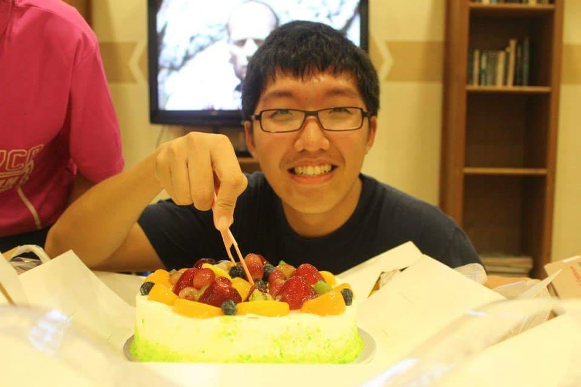
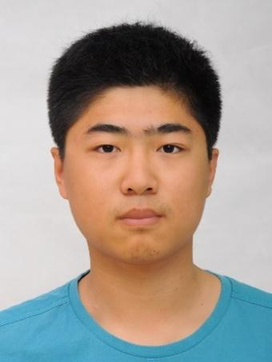
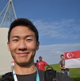
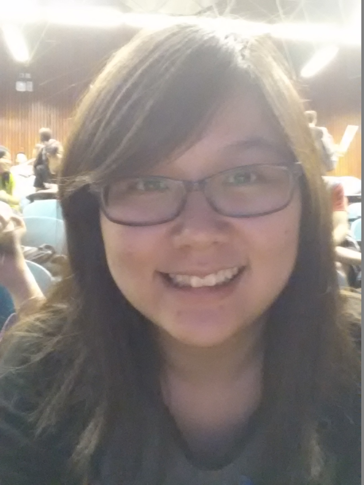

# About Us

We are a team based in the [School of Computing, National University of Singapore](http://www.comp.nus.edu.sg).

## Project Team

#### [Chen PengHao](https://github.com/chenpenghao)  
 
Role: Team Lead

In Charge of: Model
Responsibilities: Scheduling
Features implemented:

-----

#### [Jia YiLin](https://github.com/emiyak)
 
Role: Developer  

In Charge of: Commons
Responsibilities: Testing
Features implemented: 

-----

#### [WANG CHI](https://github.com/wangchi92)
 
Role: Developer  

In Charge of: Storage & Logic
Responsibilities: Integration
Features implemented:

-----

#### [Yina Toh](https://github.com/yinatoh)
 
Role: Developer  

In Charge of: Ui
Responsibilities: Documentation
Features implemented:

-----