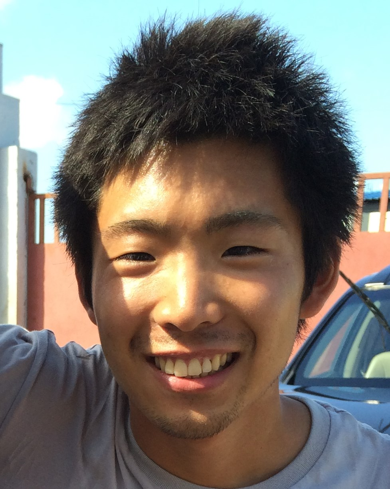
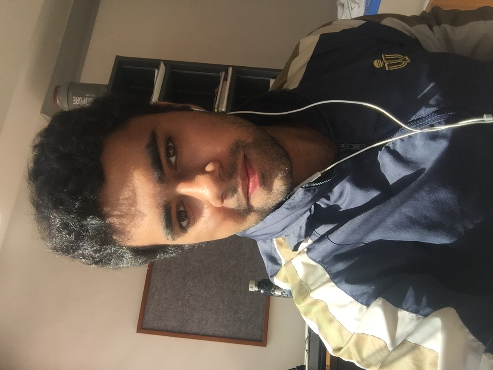

# About Us

We are a team based in the [School of Computing, National University of Singapore](http://www.comp.nus.edu.sg).

## Project Team

#### [Yoshiaki Nishimura](http://github.com/yoshi-1224)
 
**Role**: Team lead, in charge of UI & Model  
**Responsibilities**: Documentation, Deliverables and deadlines, Scheduling and tracking, Testing, Travis, Git

-----

#### [Brea Dionisio](http://github.com/bdioni)
 
**Role**: Developer, in charge of Logic  
**Responsibilities**: Code Quality, Integration, Eclipse expert, Git expert

-----

#### [Anshul Aggarwal](http://github.com/aanshul20)
 
**Role**: Developer, in charge of Storage  
**Responsibilities**: Testing

-----

# Contributors

We welcome contributions. See [Contact Us](ContactUs.md) page for more info.

* [Akshay Narayan](https://github.com/se-edu/addressbook-level4/pulls?q=is%3Apr+author%3Aokkhoy)
* [Sam Yong](https://github.com/se-edu/addressbook-level4/pulls?q=is%3Apr+author%3Amauris)
