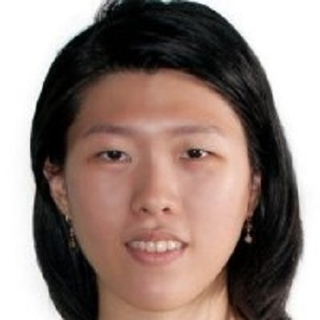
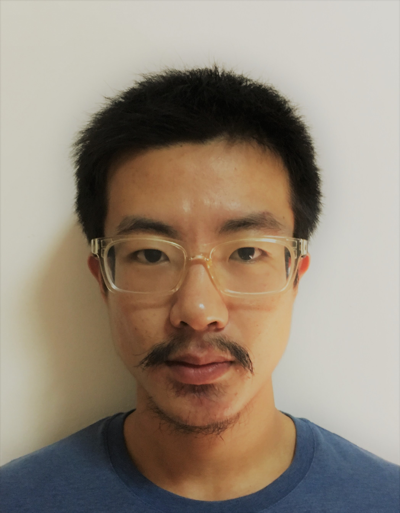

# About Us

We are a team based in the [School of Computing, National University of Singapore](http://www.comp.nus.edu.sg).

## Project Team

#### [Lee Jun Han Bryan](https://github.com/bryanleejh) 
 
Role: Team lead  
Responsibilities: Deliverables and deadlines, Scheduling and tracking  
* Components in charge of: Model, Logic
* Aspects/tools in charge of:
* Features implemented:
* Code written:
* Other major contributions:
   * Set up Travis, Appveyor, Coveralls and Codacy
   * Set up team organisation, labels and milestones

-----

#### [Huynh Van Tu An](https://github.com/arishuynhvan) 
 
Role: Developer  
Responsibilities: Testing, Integration 
* Components in charge of: Model, Logic
* Aspects/tools in charge of:
* Features implemented:
* Code written:
* Other major contributions:

-----

#### [Wang Yu](https://github.com/WangYu-g) 
 
Role: Developer  
Responsibilities: Documentation, Code Quality 
* Components in charge of: GUI, Storage
* Aspects/tools in charge of:
* Features implemented:
* Code written:
* Other major contributions:

-----

#### [Zhang HeYang](https://github.com/zhypaul) 
 
Role: Developer  
Responsibilities: Code Quality  
* Components in charge of: Storage, GUI
* Aspects/tools in charge of:
* Features implemented:
* Code written:
* Other major contributions:
