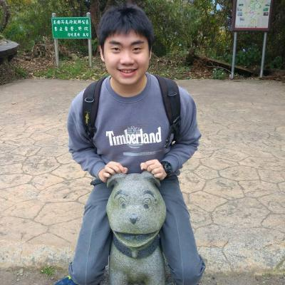

# About Us

We are a team based in the [School of Computing, National University of Singapore](http://www.comp.nus.edu.sg).

##### Work in progress

## Project Team W14-B1

-----

#### [Ellango Vesali](http://github.com/vesaliE)
 
Role: Developer  
Responsibilities: Deliverables and deadlines, Documentation 
Component in charge of: [Storage](https://github.com/CS2103JAN2017-W14-B1/main/blob/master/docs/DeveloperGuide.md#25-storage-component) 

Features implemented:  
* [Sort Command](https://github.com/CS2103JAN2017-W14-B1/main/blob/master/docs/UserGuide.md#310-sorting-tasks-sort)  
* [Save Commmand](https://github.com/CS2103JAN2017-W14-B1/main/blob/master/docs/UserGuide.md#312-saving-the-program-data-to-a-specified-path-save) 
* [Load Command](https://github.com/CS2103JAN2017-W14-B1/main/blob/master/docs/UserGuide.md#313-loading-the-program-data-from-a-specified-path-load) 

Code Written:  
[[Functional Code]()] [[Testing Code]()]

-----

#### [Lim Jie](http://github.com/limjie)
 
Role: Developer  
Responsibilities: Testing, Integration 
Component in charge of: [UI](https://github.com/CS2103JAN2017-W14-B1/main/blob/master/docs/DeveloperGuide.md#22-ui-component) 

Features implemented: 
* [Edit Command](https://github.com/CS2103JAN2017-W14-B1/main/blob/master/docs/UserGuide.md#37-modifies-a-current-task-edit) 
* [Find Command](https://github.com/CS2103JAN2017-W14-B1/main/blob/master/docs/UserGuide.md#33-finding-a-task-find) 

Code Written:  
[[Functional Code]()] [[Testing Code]()]

-----

#### [Sherina Toh Shi Pei](http://github.com/sherinatoh)
 
Role: Developer  
Responsibilities: Scheduling and tracking  
Component in charge of: [Logic](https://github.com/CS2103JAN2017-W14-B1/main/blob/master/docs/DeveloperGuide.md#23-logic-component)  

Features implemented:  
* [Add Command](https://github.com/CS2103JAN2017-W14-B1/main/blob/master/docs/UserGuide.md#32-adding-a-task-add)  
* [Done/Undone Command](https://github.com/CS2103JAN2017-W14-B1/main/blob/master/docs/UserGuide.md#done) 

Code Written:  
[[Functional Code]()] [[Testing Code]()]

-----

#### [Wang Pengcheng](https://github.com/peng229)
 
 Role: Developer  
 Responsibilities: Integration, Documentation 
 Component in charge of: [Model](https://github.com/CS2103JAN2017-W14-B1/main/blob/master/docs/DeveloperGuide.md#24-model-component) 
 
 Features implemented:  
 * [Undo Command](https://github.com/CS2103JAN2017-W14-B1/main/blob/master/docs/UserGuide.md#38-undoing-changes-undo) 
 * [Redo Command](https://github.com/CS2103JAN2017-W14-B1/main/blob/master/docs/UserGuide.md#39-reverting-undos-redo) 
 * [Flexible Command Format](https://github.com/CS2103JAN2017-W14-B1/main/blob/master/docs/UserGuide.md#3-features) 
 
Code Written:  
[[Functional Code]()] [[Testing Code]()]

 -----

 -----

