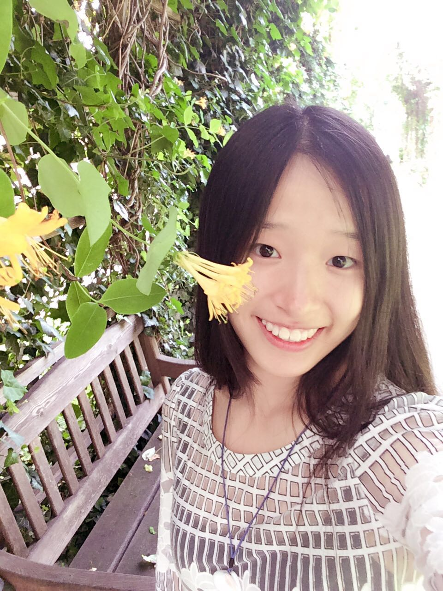
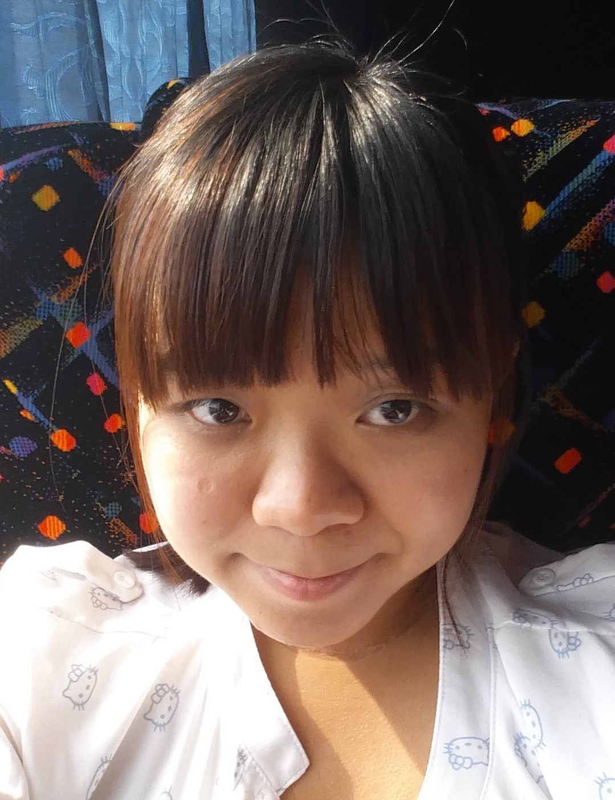
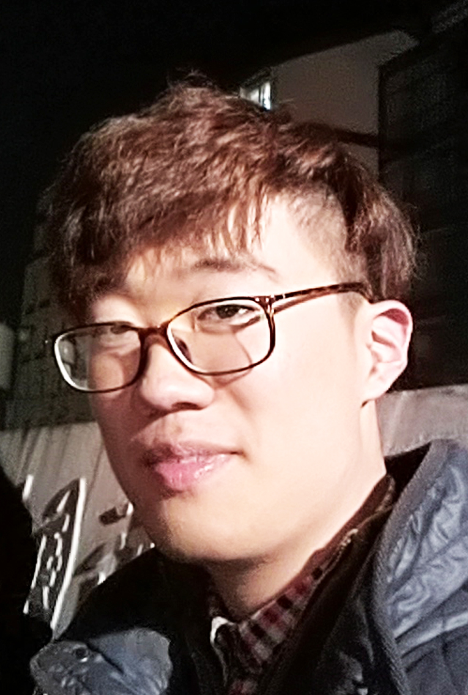

# About Us

We are a team based in the [School of Computing, National University of Singapore](http://www.comp.nus.edu.sg).

## Project Team

#### [Wang Zexin](https://github.com/wangzexin)
 
Role: Developer  
Responsibilities: Dev Ops

-----

#### [Yan Xiaoxuan](https://github.com/Matilda-Yxx)
 
Role: Developer  
Responsibilities: UI

-----

#### [Jong Xue Min Shermine Ruth](https://github.com/ShermineJong)
 
Role: Developer  
Responsibilities: Logic and Storage

-----

#### [Mou Ziyang](http://github.com/mouziyanglovestudy)
 
Role: Developer  
Responsibilities: Dev Ops

-----

# Contributors

We welcome contributions. See [Contact Us](ContactUs.md) page for more info.

* [Damith C. Rajapakse](http://www.comp.nus.edu.sg/~damithch)
