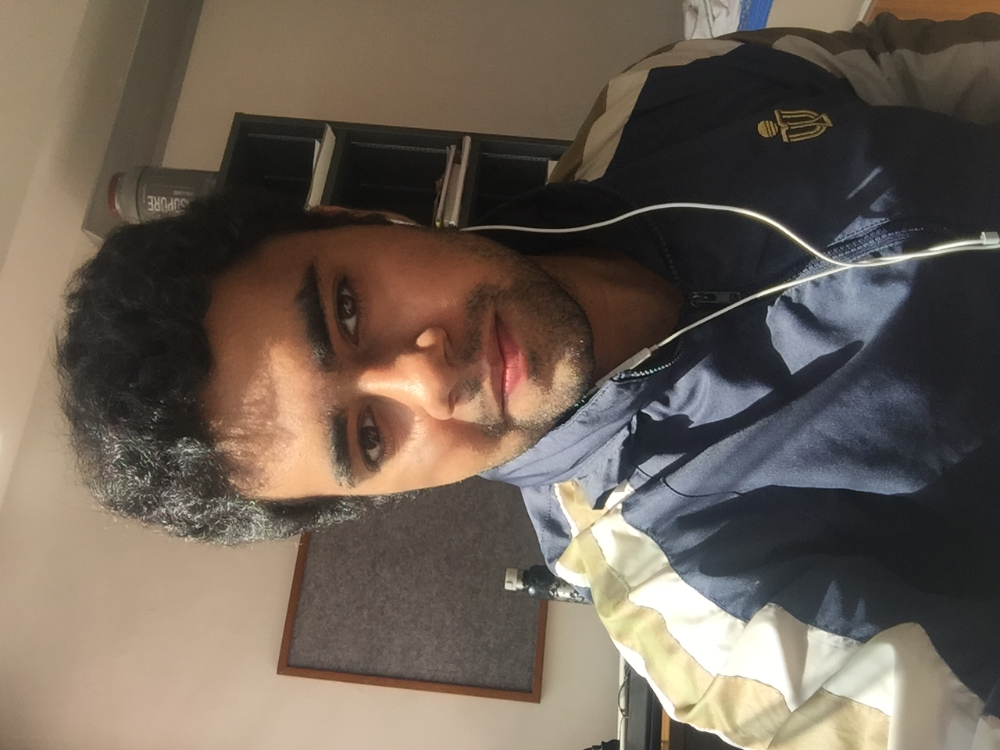

# About Us

We are a team based in the [School of Computing, National University of Singapore](http://www.comp.nus.edu.sg).

## Project Team

#### [Akshay Narayan](http://www.comp.nus.edu.sg/~okkhoy)  
 
**Role**: Project Advisor

-----

#### [Yoshiaki Nishimura](http://github.com/yoshi-1224)
 
Role: Team lead  
Responsibilities: Documentation, Deliverables and deadlines, Scheduling and tracking, In charge of Model, Logic

-----

#### [Brea Dionisio](http://github.com/bdioni)
 
Role: Developer  
Responsibilities: Code Quality, Integration, Eclipse expert, Git expert, In charge of Model, Logic

-----

#### [Anshul Aggarwal](http://github.com/aanshul20)
 
Role: Developer  
Responsibilities: Testing, In charge of GUI, Storage

-----

# Contributors

We welcome contributions. See [Contact Us](ContactUs.md) page for more info.

* [Akshay Narayan](https://github.com/se-edu/addressbook-level4/pulls?q=is%3Apr+author%3Aokkhoy)
* [Sam Yong](https://github.com/se-edu/addressbook-level4/pulls?q=is%3Apr+author%3Amauris)
