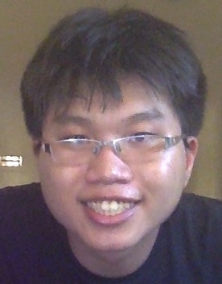

# About Us

We are a team based in the [School of Computing, National University of Singapore](http://www.comp.nus.edu.sg).

## Project Team

#### [Louis Lai](http://github.com/louislai)
 
Role: Team Leader  

* Components in charge of: UI, Model, Storage
* Aspects/tools in charge of: Scheduling and tracking, CI, Code quality

-----

#### [Melvin Tan](http://github.com/Melvin-Tan)
 
Role: Developer  

* Components in charge of: Task, Event
* Aspects/tools in charge of: Testing, Eclipse

-----

#### [Lewis Koh](http://github.com/Rinder5)
 
Role: Developer  

* Components in charge of: Tag, Search/Filter
* Aspects/tools in charge of: Documentation
