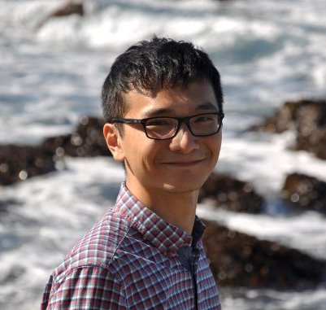

# About Us

We are a team based in the [School of Computing, National University of Singapore](http://www.comp.nus.edu.sg).

## Project Team

#### [Xu Bili](http://github.com/xbili)
 
**Role**: Team Lead 
**Responsibilities**: UI
* Scheduling & deadlines
* Assign tasks
* Faciliate feature discussions 
* Features implemented:
   * [Mark tasks](https://github.com/CS2103JAN2017-W15-B3/main/blob/master/docs/UserGuide.md#26-mark-task--mark)
   * [Autocomplete](https://github.com/CS2103JAN2017-W15-B3/main/blob/master/docs/UserGuide.md#216-autocomplete)
* Code written: [[functional code](https://github.com/CS2103JAN2017-W15-B3/main/blob/master/collated/main/A0124368A.md)][[test code](https://github.com/CS2103JAN2017-W15-B3/main/blob/master/collated/main/A0124368A.md)]
* Other major contributions:
  * Did the initial refactoring from AddressBook to TaskManager
  * Set up Travis, Appveyor, and Coveralls 

#### [Shi Yanzhang](http://github.com/mynameisyz)
 
**Role**: Testing & QA 
**Responsibilities**: Storage
* Ensure test cases covers all edge cases
* Review test cases for each PR 
* Features implemented:
   * [Undo command](https://github.com/CS2103JAN2017-W15-B3/main/blob/master/docs/UserGuide.md#211-undo--undo)
   * [Redo command](https://github.com/CS2103JAN2017-W15-B3/main/blob/master/docs/UserGuide.md#212-redo--redo)
* Code written: [[functional code](https://github.com/CS2103JAN2017-W15-B3/main/blob/master/collated/main/A0148087W.md)][[test code](https://github.com/CS2103JAN2017-W15-B3/main/blob/master/collated/main/A0148087W.md)]
* Other major contributions:
  * Did the initial refactoring from AddressBook to TaskManager

#### [Lam Guang Jun](http://github.com/gjlam95)
 
**Role**: Code quality 
**Responsibilities**: Logic
* Ensures project's code quality
* Only person who can merge PRs after code review 
* Features implemented:
   * [Sort tasks](https://github.com/CS2103JAN2017-W15-B3/main/blob/master/docs/UserGuide.md#24-sort-tasks--sort)
* Code written: [[functional code](https://github.com/CS2103JAN2017-W15-B3/main/blob/master/collated/main/A0148081H.md)][[test code](https://github.com/CS2103JAN2017-W15-B3/main/blob/master/collated/main/A0148081H.md)]
* Other major contributions:
  * Did the initial refactoring from AddressBook to TaskManager

#### [Han Lynn](http://github.com/hlynn93)
 
**Role**: Integration & architecture 
**Responsibilities**: Model
* Coordinate inter-component APIs
* Make architecture decisions 
* Features implemented:
   * [Find tasks](https://github.com/CS2103JAN2017-W15-B3/main/blob/master/docs/UserGuide.md#213-find--find)
   * [Schedule tasks](https://github.com/CS2103JAN2017-W15-B3/main/blob/master/docs/UserGuide.md#28-schedule-work-in-progress--schedule)
* Code written: [[functional code](https://github.com/CS2103JAN2017-W15-B3/main/blob/master/collated/main/A0126345J.md)][[test code](https://github.com/CS2103JAN2017-W15-B3/main/blob/master/collated/main/A0126345J.md)]
* Other major contributions:
  * Did the initial refactoring from AddressBook to TaskManager

