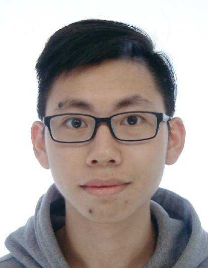
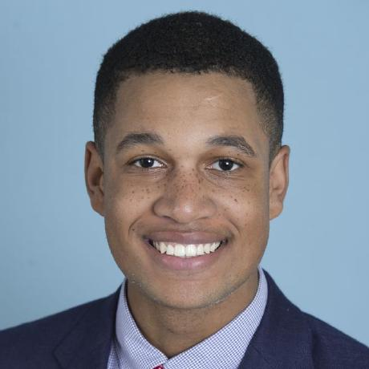

# About Us

We are a team based in the [School of Computing, National University of Singapore](http://www.comp.nus.edu.sg).

## Project Team

#### [Cheuk Ting](https://github.com/ctleungac)  
 
Role: Developer  
Responsibilities: Logic

(Subject to Change)

-----

#### [Hsieh Hsin Han](https://github.com/Tony-Hsieh)
 
Role: Developer  
Responsibilities: UI

(Subject to Change)

-----

#### [Malik Jabati](https://github.com/SmartyMJ)
 
Role: Developer  
Responsibilities: Data

(Subject to Change)

-----

#### [Ali Rizvi](https://github.com/EntitySK)
 
Role: Developer  
Responsibilities: Dev Ops

(Subject to Change)

-----

# Contributors

We welcome contributions. See [Contact Us](ContactUs.md) page for more info.

* [Akshay Narayan](https://github.com/se-edu/addressbook-level4/pulls?q=is%3Apr+author%3Aokkhoy)
* [Sam Yong](https://github.com/se-edu/addressbook-level4/pulls?q=is%3Apr+author%3Amauris)
