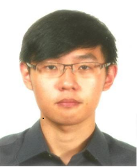

# About Us

We are a team based in the [School of Computing, National University of Singapore](http://www.comp.nus.edu.sg).

## Project Team

#### [Alvin Loh](http://github.com/alvinlyj)  
 
**Role:** Team Leader  
**Responsibilities:** Integration & Documentation  
**Components in charge of:** UI, Storage & Commons  
**Features implemented:**
* [Update command](https://github.com/CS2103JAN2017-T11-B1/main/blob/master/docs/UserGuide.md#33-update-an-existing-task--update)
* [Delete command](https://github.com/CS2103JAN2017-T11-B1/main/blob/master/docs/UserGuide.md#34-delete-an-existing-task-delete)
* [Change save location command](https://github.com/CS2103JAN2017-T11-B1/main/blob/master/docs/UserGuide.md#315-saving-the-data-save)
* [Undo command](https://github.com/CS2103JAN2017-T11-B1/main/blob/master/docs/UserGuide.md#313-to-undo-your-previous-commands-undo)
* [Redo command](https://github.com/CS2103JAN2017-T11-B1/main/blob/master/docs/UserGuide.md#314-to-redo-your-previous-commands-redo)
* Date parsing  
**Code written:** 
* [Functional code](https://github.com/CS2103JAN2017-T11-B1/main/blob/master/collated/main/A0142418L.md) 
* [Test code](https://github.com/CS2103JAN2017-T11-B1/main/blob/master/collated/test/A0142418L.md)  
**Other major contributions:**
* Responsible for the integration GUI component into existing and new functionalities implemented

-----

#### [Joel Lee](http://github.com/joelleejh)
 
**Role:** Developer  
**Responsibilities:** Testing  
**Components in charge of:** Logic
**Features implemented:**
* [Search command](https://github.com/CS2103JAN2017-T11-B1/main/blob/master/docs/UserGuide.md#36-search-through-all-existing-task-by-entering-keywordsdates-search)
* [List command](https://github.com/CS2103JAN2017-T11-B1/main/blob/master/docs/UserGuide.md#39-to-sort-through-the-list-of-task-displayed-list)
* [Recurring command](https://github.com/CS2103JAN2017-T11-B1/main/blob/master/docs/UserGuide.md#314-recurring-command-recur)  
**Code written:** 
* [Functional code](https://github.com/CS2103JAN2017-T11-B1/main/blob/master/collated/main/A0141102H.md) 
* [Test code](https://github.com/CS2103JAN2017-T11-B1/main/blob/master/collated/test/A0141102H.md)  
**Other major contributions:**
* Responsible for the initial integration of entire Test package into task manager

-----

#### [Koh Jun Wei](http://github.com/KohJunWei)
 
**Role:** Developer  
**Responsibilities:** Code Quality & Implementation  
**Components in charge of:** Model
**Features implemented:**
* [Add command](https://github.com/CS2103JAN2017-T11-B1/main/blob/master/docs/UserGuide.md#32-adding-a-new-task-add)
* [Mark command](https://github.com/CS2103JAN2017-T11-B1/main/blob/master/docs/UserGuide.md#37-to-mark-tasks-as-completed-mark)
* [Unmark command](https://github.com/CS2103JAN2017-T11-B1/main/blob/master/docs/UserGuide.md#38-to-mark-tasks-as-uncompleted-unmark)
* [Completed command](https://github.com/CS2103JAN2017-T11-B1/main/blob/master/docs/UserGuide.md#310-to-sort-through-the-list-of-task-displayed-completed)  
**Code written:** 
* [Functional code](https://github.com/CS2103JAN2017-T11-B1/main/blob/master/collated/main/A0139520L.md) 
* [Test code](https://github.com/CS2103JAN2017-T11-B1/main/blob/master/collated/test/A0139520L.md)  
**Other major contributions:**
* Responsible for the structure of the model component (How task data are handled and stored)

-----

# Contributors

We welcome contributions. See [Contact Us](ContactUs.md) page for more info.
