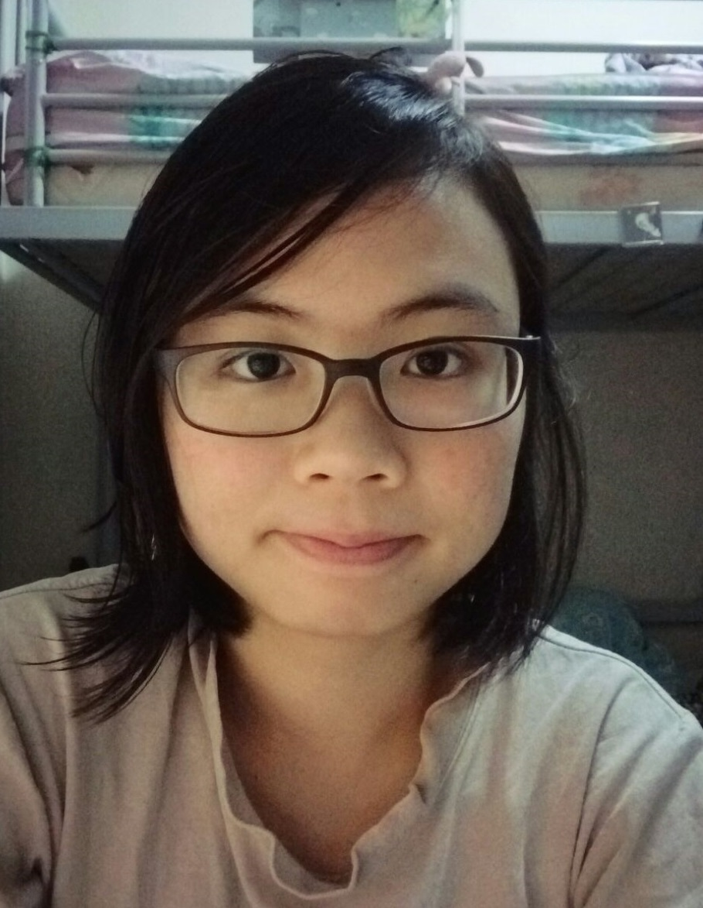

# About Us

We are a team based in the [School of Computing, National University of Singapore](http://www.comp.nus.edu.sg).

## Project Team

#### [Luo Wenhan](http://github.com/FausticSun)
  
**Role:** Team Lead  
**Components in charge of:** Model  

-----

#### [Pang Shi Ying](http://github.com/invisidark)
  
**Role:** Documentation, Scheduling and Tracking  
**Components in charge of:** UI  

-----

#### [Pang Zheng Yu](http://github.com/pzyu)
  
**Role:** Git Integration, Code Quality  
**Components in charge of:** Logic  

-----

#### [Wang Ce](https://github.com/wangce94)
  
**Role:** Testing, Deliverables and Deadlines  
**Components in charge of:** Storage  

 -----

# Contributors

We welcome contributions. See [Contact Us](ContactUs.md) page for more info.

* [Akshay Narayan](https://github.com/se-edu/addressbook-level4/pulls?q=is%3Apr+author%3Aokkhoy)
* [Sam Yong](https://github.com/se-edu/addressbook-level4/pulls?q=is%3Apr+author%3Amauris)
