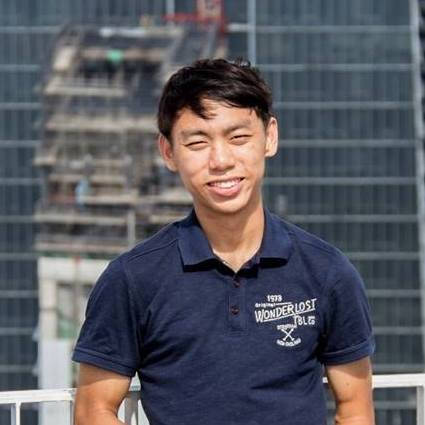

# About Us

We are a team based in the [School of Computing, National University of Singapore](http://www.comp.nus.edu.sg).

## Project Team

#### [Damith C. Rajapakse](http://www.comp.nus.edu.sg/~damithch)  
 
**Role**: Project Advisor

-----

#### [Gabriel Sim](http://github.com/gabrielsim1993)
 
Role: Developer  
Responsibilities: Team Leader, Logic, Deliverables, Git expert

-----

#### [Maggie Li Yundi](http://github.com/maggiemeow)
 
Role: Developer  
Responsibilities: Testing, Model, Code Quality, Integration

-----

#### [Tang Shenqi](http://github.com/tangshenqi)
 
Role: Developer  
Responsibilities: UI, Eclipse expert

-----

#### [Aditya Hendraatmaja](https://github.com/ahendraatmaja)
 Role: Developer  
 Responsibilities: Documentation, Data

 -----

# Contributors

We welcome contributions. See [Contact Us](ContactUs.md) page for more info.

* [Akshay Narayan](https://github.com/se-edu/addressbook-level4/pulls?q=is%3Apr+author%3Aokkhoy)
* [Sam Yong](https://github.com/se-edu/addressbook-level4/pulls?q=is%3Apr+author%3Amauris)
