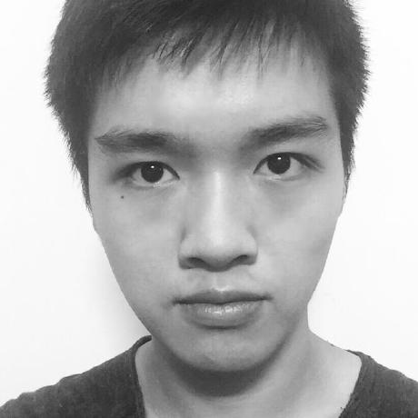
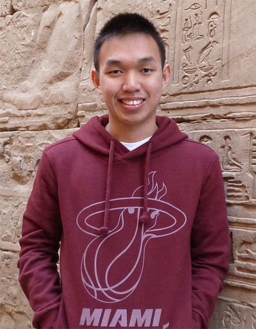
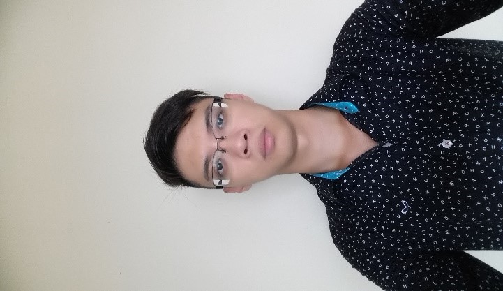

# About Us

Hello there from Burdens! We are a software enginerring team based in the [School of Computing, National University of Singapore](http://www.comp.nus.edu.sg).

## Project Team
#### [Nguyen Quoc Bao](https://github.com/bqnguyen94)  
 
**Role**: Team Lead  
**Responsibilities** : Testing, Eclipse and Java expert
**Component** : Logic, Storage
-----

#### [Lee Wan Qing](https://github.com/wanqingg)  
 
**Role**: Designer, Timekeeper
**Responsibilities**: Code Quality, Scheduling and Tracking
**Component** : Model, GUI
-----

#### [Gerald Wong Wei Chuen](https://github.com/geraldwong)  
 
**Role**: UI 
**Responsibilities**: Code Quality, JavaFX
**Component** : GUI, Logic
-----

#### [Johann Wong Jun Guo](https://github.com/Jslyfer)  
 
**Role**: Documentation, Integration, Git expert
**Responsibilities**: Code Quality, Update documentation, Integration of branches
**Component** : Logic, Model and Docs
-----

# Contributors

We welcome contributions. See [Contact Us](ContactUs.md) page for more info.

* [Akshay Narayan](https://github.com/se-edu/addressbook-level4/pulls?q=is%3Apr+author%3Aokkhoy)
* [Sam Yong](https://github.com/se-edu/addressbook-level4/pulls?q=is%3Apr+author%3Amauris)
* [Damith C. Rajapakse](http://www.comp.nus.edu.sg/~damithch)
* [Joshua Lee](http://github.com/lejolly)
* [Leow Yijin](http://github.com/yijinl)
* [Martin Choo](http://github.com/m133225)
* [Thien Nguyen](https://github.com/ndt93)
* [You Liang](http://github.com/yl-coder)
 
