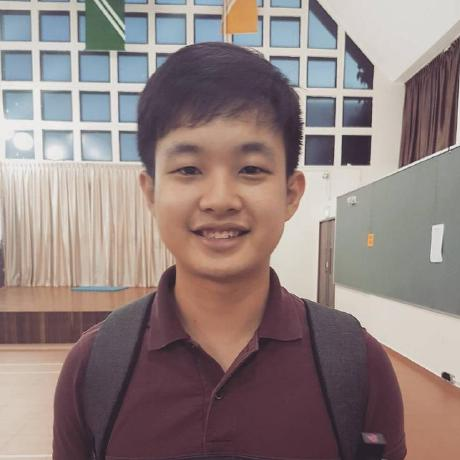
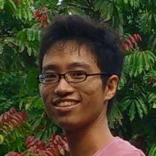

# About Us

We are a team based in the [School of Computing, National University of Singapore](http://www.comp.nus.edu.sg).

## Project Team

#### [Yee Jian Feng, Eric](http://github.com/yeejfe)  
 
**Roles**: Team Lead, Integration, Scheduling  
**Responsibilities**:
* Aspects/tools in charge of: Managing GitHub organization page
* Components in charge of:
* Features implemented:
* Code written:
* Other major contributions:
  * Initial refactoring from AddressBook-Level-4 to SavvyTo-Do
  * Issue tracker and repo setup
  * Set up Travis, Appveyor, Coveralls and Codacy

-----

#### [Goh Jing Loon](https://github.com/jingloon)
 
**Role**: Documentation, UI Expert  
**Responsibilities**:
* Aspects/tools in charge of: UI Element designs
* Components in charge of:
* Features implemented:
* Code written:
* Other major contributions:
    * UI mockup and prototyping
    * Post initial refactoring system testings

-----

#### [Joel Lim](https://github.com/aljorhythm)
 
**Role**: Code Quality, Git Expert  
**Responsibilities**:
* Aspects/tools in charge of:
* Components in charge of: JUnit testings
* Features implemented:
* Code written:
* Other major contributions:
    * Post initial refactoring system testings
-----

#### [Wang Si Qi](https://github.com/coyotestarrkwsq)
 
**Role**: Testing, Deliverables and Deadlines  
**Responsibilities**:
* Aspects/tools in charge of:
* Components in charge of:
* Features implemented:
	* Undo operation
	* Redo operation
* Code written:
* Other major contributions:
    * Initial refactoring from AddressBook-Level-4 to SavvyTo-Do

 -----

# Contributors

We welcome contributions. See [Contact Us](ContactUs.md) page for more info.
