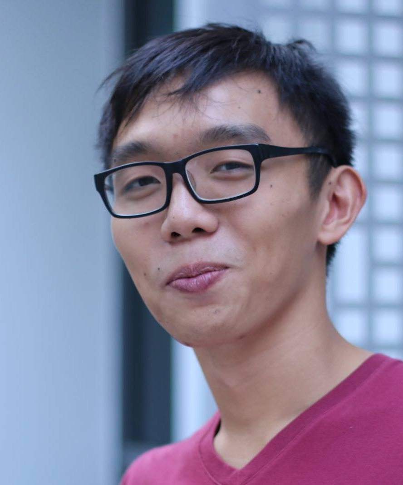

# About Us

We are a team based in the [School of Computing, National University of Singapore](http://www.comp.nus.edu.sg).

## Project Team

#### [Lee Jun Han Bryan](https://github.com/bryanleejh) 
 
Role: Team lead  
* Components in charge of: Model, Logic
* Aspects/tools in charge of: Deliverables and deadlines  
* Features implemented:
   * [Add floating tasks](https://github.com/CS2103JAN2017-F12-B4/main/blob/master/docs/UserGuide.md#221-adding-a-floating-task-addf)
   * [Add deadline tasks]
(https://github.com/CS2103JAN2017-F12-B4/main/blob/master/docs/UserGuide.md#222-adding-a-deadline-task-addd)
* Code written: [[functional code](https://github.com/CS2103JAN2017-F12-B4/main/blob/master/collated/main/A0146738U.md)][[test code](https://github.com/CS2103JAN2017-F12-B4/main/blob/master/collated/test/A0146738U.md)]
* Other major contributions:
   * Did initial refactoring from AddressBook to TodoList
   * Set up Travis, Appveyor, Coveralls and Codacy
   * Set up team organisation, labels and milestones

-----

#### [Huynh Van Tu An](https://github.com/arishuynhvan) 
 
Role: Developer  
Responsibilities: Testing, Integration 
* Components in charge of: Model, Logic
* Aspects/tools in charge of:
* Features implemented:
* Code written:
* Other major contributions:

-----

#### [Wang Yu](https://github.com/WangYu-g) 
 
Role: Developer  
* Components in charge of: Logic, Model, GUI
* Aspects/tools in charge of: Testing
* Features implemented:
	* [Show Command](https://github.com/CS2103JAN2017-F12-B4/main/blob/master/docs/UserGuide.md#26-showing-done-tasks--show)
	* [Finish Command](https://github.com/CS2103JAN2017-F12-B4/main/blob/master/docs/UserGuide.md#213-finish-a-task--finish)
	* [List Command](https://github.com/CS2103JAN2017-F12-B4/main/blob/master/docs/UserGuide.md#23-listing-undone-tasks--list)
* Code written: [[functional code](https://github.com/CS2103JAN2017-F12-B4/main/blob/master/collated/main/A0105748B.md)][[test code](https://github.com/CS2103JAN2017-F12-B4/main/blob/master/collated/test/A0105748B.md)]
* Other major contributions:
	* Natty Date Parser
	* Make tasks fields optional except task description
	* Modify UI
	* Design new GUI

-----

#### [Zhang HeYang](https://github.com/zhypaul) 
 
Role: Developer  
Responsibilities: Code Quality  
* Components in charge of: Storage, GUI
* Aspects/tools in charge of:
* Features implemented:
* Code written:
* Other major contributions:
