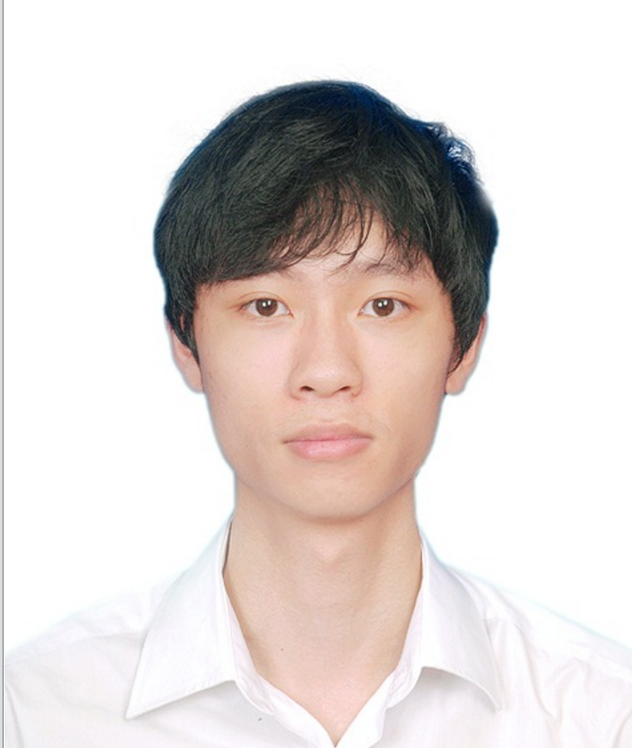
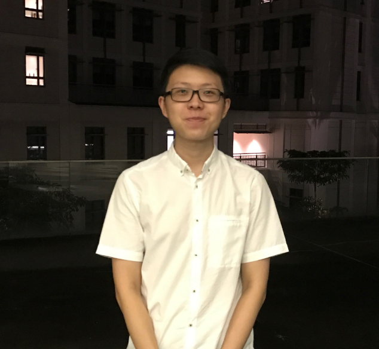
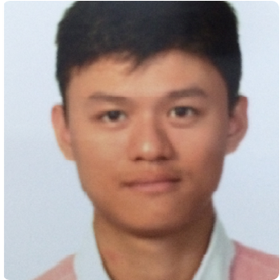
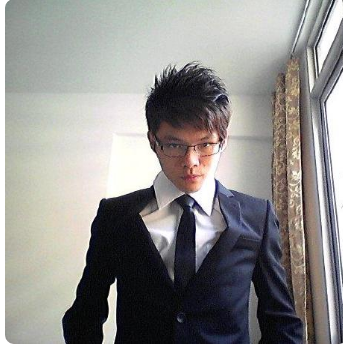

# About Us

We are a team based in the [School of Computing, National University of Singapore](http://www.comp.nus.edu.sg).

## Project Team

#### [MY DUYHOANG LONG](https://github.com/myduyhoanglong)  
 
**Role**: Testing, Team Lead  
**Responsibilities**: UI

-----

#### [IVAN KOH](https://github.com/ivankws)
 
**Role**: Code quality  
**Responsibilities**: Documentation

-----

#### [TANG DI FENG](https://github.com/e0011840)
 
**Role**: Integration  
**Responsibilities**: Storage

-----

#### [ZHANG YAN HAO](https://github.com/vane1992)
 
**Role**: Scheduling and deadlines, Code quality  
**Responsibilities**: Model

-----

# Contributors

We welcome contributions. See [Contact Us](ContactUs.md) page for more info.

* [Tang Di Feng](https://github.com/e0011840)
* [My DuyHoang Long](https://github.com/myduyhoanglong)
* [Ivan Koh] (https://github.com/ivankws)
* [Zhang Yan Hao] (https://github.com/vane1992)
