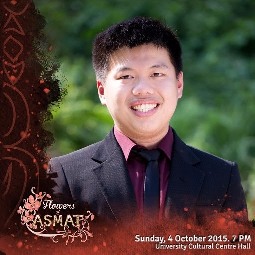
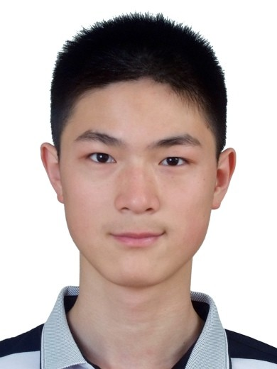
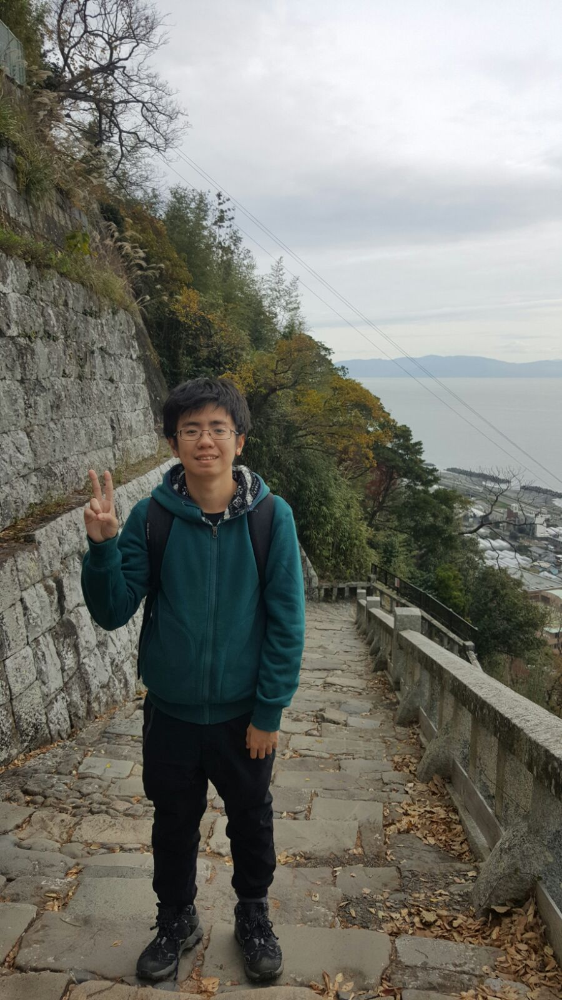

# About Us

We are a team from CS2103.

## Project Team

#### [tutor]
 
**Role**: Project Advisor

-----

#### [Christopher Hendra](http://github.com/chrishendra93)
 
Role: Team Lead, Testing Developer 
Responsibilities: Model

-----

#### [Deng Yue](http://github.com/spenceryue97)
 
Role: Developer, Integration, Documentation Scheduling and tracking  
Responsibilities: Logic

-----

#### [Cindra](http://github.com/cindratan)
 
Role: Developer, Code quality, Scheduling and tracking  
Responsibilities: UI

-----

#### [Zhuang Lei](https://github.com/zl1993)
 
 Role: Developer, Deliverables and deadlines, Testing  
 Responsibilities: Storage

 -----
 | Name  | Matriculation No |
 | ----- | ----- |
 | Christopher Hendra | [A0130979U](https://github.com/CS2103JAN2017-F11-B1/main/blob/master/collated/main/A0130979U.md) |
 | Cindra | [A0164039E](https://github.com/CS2103JAN2017-F11-B1/main/blob/master/collated/main/A0164039E.md) |
 | Deng Yue | [A0164440M](https://github.com/CS2103JAN2017-F11-B1/main/blob/master/collated/main/A0164440M.md) |
 | Zhuang Lei | [A0140055W](https://github.com/CS2103JAN2017-F11-B1/main/blob/master/collated/main/A0140055W.md) |
