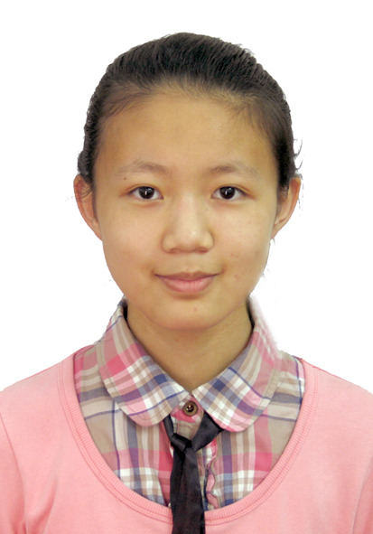

# About Us

We are a team based in the [School of Computing, National University of Singapore](http://www.comp.nus.edu.sg).

## Project Team
#### [Leslie Ho Zong Hong](https://github.com/e0011875)
 
Year 2 Computer Science Major 
**Role**: Team lead, Developer  
**Responsibilities**: Deliverables and deadlines, Scheduling and tracking  
* Components in charge of: UI, Documentation
* Features implemented:
  * View Command
  * Done Command
* Code written: [[functional code](https://github.com/CS2103JAN2017-F14-B3/main/blob/master/collated/main/A0135998H.md)]
[[test code](https://github.com/CS2103JAN2017-F14-B3/main/blob/master/collated/test/A0135998H.md)]
* Other Major Contributions:
 * Reskin UI design
 * Wrote User Guide
 * Implemented Clock and Task Tab widget

-----

#### [Tan Li Hao](https://github.com/LiHaoTan)
 
Year 2 Computer Science Major 
**Role**: Developer  
**Responsibilities**: Testing, Integration  
* Components in charge of: Logic
* Features implemented:
  * Add Command
  * Edit Command
* Code written: [[functional code](https://github.com/CS2103JAN2017-F14-B3/main/blob/master/collated/main/A0140023E.md)]
[[test code](https://github.com/CS2103JAN2017-F14-B3/main/blob/master/collated/test/A0140023E.md)]
* Other Major Contributions:
  * Did the initial refactoring from AddressBook to iManager
  * Set up CI, Coveralls and Codacy
-----

#### [Liu Yulin](https://github.com/LiuYulin0629)
 
Year 2 Computer Science Major 
**Role**: Developer  
**Responsibilities**: Code quality  
* Components in charge of: Model, Storage
* Features implemented:
  * Save Command
  * Undo and Redo Command
* Code written: [[functional code](https://github.com/CS2103JAN2017-F14-B3/main/blob/master/collated/main/A0148052L.md)]
* Other Major Contributions:

-----
#### [Nirandika Wanigasekara](https://github.com/nirandiw)
 
**Role**: Tutor

-----
