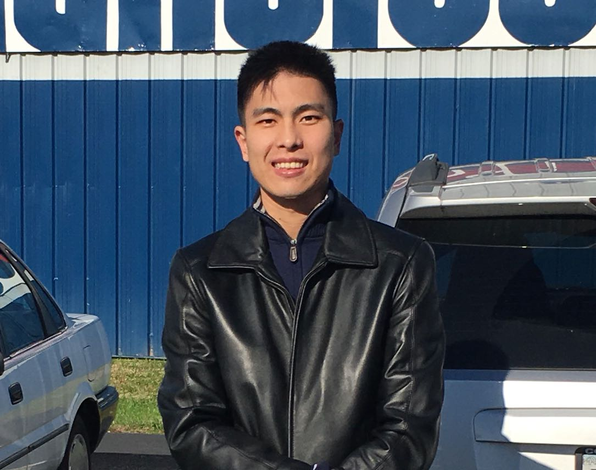
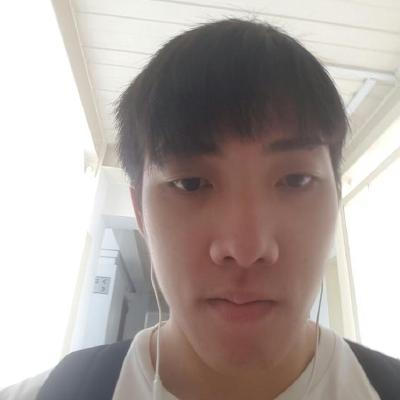

# About Us

Hello from the creators of **Typed**! We like to call ourselves Typedwriters. We are a software engineering team based in the [School of Computing, National University of Singapore](http://www.comp.nus.edu.sg).

## Project Team

#### [Lee Pei Xuan](http://github.com/pyxyyy)  
 
Role: Chief Technical(ly Not An) Officer (CTO), aka Chief Typed Officer  
Responsibilities: Team Lead, Deliverables & Deadlines, Testing
Component: Logic

-----

#### [Low Yong Siang](http://github.com/YongSiang94)
 
Role: Director of First Impressions  
Responsibilities: Documentation
Component: GUI

-----

#### [Mun Le Yuan](http://github.com/Ley94)
 
Role: Director of Back Side  
Responsibilities: Integration
Component: Storage

-----

#### [Yim Chia Hui](http://github.com/sharkey1314)
 
Role: Director of Unrequited Love Because No One Cares About The People Behind The Scene  
Responsibilities: Code Quality, Scheduling & Tracking
Component: Model

-----

# Contributors

We welcome contributions. See [Contact Us](ContactUs.md) page for more info.
