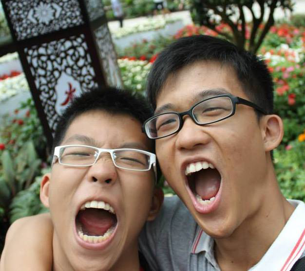
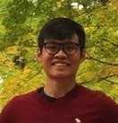

# About Us

We are a team based in the [School of Computing, National University of Singapore](http://www.comp.nus.edu.sg).

## Project Team

#### [Lim Jing Rong](http://github.com/jjingrong)
 
Role: Team Lead, Developer  
Responsibilities: Deliverables and deadlines, Documentation, Parsing, Integration, Scheduling, Tracking and Professional Firefighter.

----

#### [Lim Huan Hock](http://github.com/huanhock)
 
Role: Developer, Tester, Eclipse Expert  
Responsibilities: In charge of GUI, Model and Logic, Testing, Help team members with Eclipse

----

#### [Wong Woon Fui](http://github.com/benwongwf)
 
Role: Developer  
Responsibilities: In charge of development operation, data, helping the team with miscellaneous items.

-----

# Contributors

We welcome contributions. See [Contact Us](ContactUs.md) page for more info.

* [Lim Jing Rong](https://github.com/CS2103AUG2016-F12-B2/main/pulls?q=is%3Apr+author%3Ajjingrong)
* [Lim Huan Hock](https://github.com/CS2103AUG2016-F12-B2/main/pulls?q=is%3Apr+author%3Ahuanhock)
* [Wong Woon Fui](https://github.com/CS2103AUG2016-F12-B2/main/pulls?q=is%3Apr+author%3Abenwongwf)
