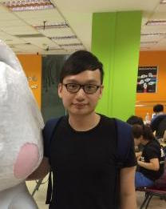

# About Us

We are a team based in the [School of Computing, National University of Singapore](http://www.comp.nus.edu.sg).

## Project Team

#### [Dana Baghabrah](http://github.com/danab101)
 
Role: Developer  
Responsibilities: 

-----

#### [Francis Cheng](http://github.com/francischeng070)
 
Role: Developer  
Responsibilities: 

-----

#### [Wong Jun Wei](http://github.com/wjunwei94)
 
Role: Developer  
Responsibilities: 

-----

#### [Leong Wei Wen](https://github.com/lwwenz)
 
 Role: Developer  
 Responsibilities: 

 -----

# Contributors

We welcome contributions. See [Contact Us](ContactUs.md) page for more info.

* [Akshay Narayan](https://github.com/se-edu/addressbook-level4/pulls?q=is%3Apr+author%3Aokkhoy)
* [Sam Yong](https://github.com/se-edu/addressbook-level4/pulls?q=is%3Apr+author%3Amauris)
