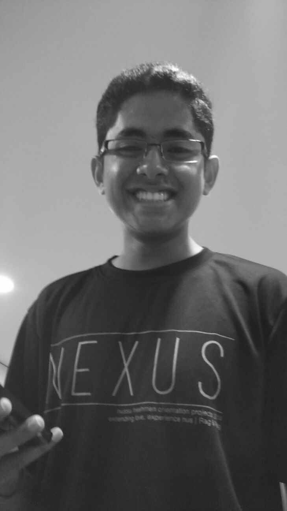

# About Us

We are a team based in the [School of Computing, National University of Singapore](http://www.comp.nus.edu.sg).

## Project Team

#### [Lee Yan Hwa](https://github.com/leeyh20)
  
**Role**: Team Lead  

* Components in charge of: Model, Storage
* Aspects/tools in charge of: Eclipse, Travis CI
* Features implemented:
    * TBA
* Code written: [functional code]() [test code]() [docs]()
* Other major contributions:
* Aspects responsible for:　     　　　　　
    * Ensuring tasks are done properly and on time
    * Integration: Versioning of the code, maintaining the code repository, integrating various parts of the software to create a whole

-----

#### [Ram Janarthan](https://github.com/ramjanarthan)
 
**Role**: Developer  

* Components in charge of: Logic, UI
* Aspects/tools in charge of: JavaFX
* Features implemented:
    * TBA
* Code written: [functional code]() [test code]() [docs]()
* Other major contributions:
* Aspects responsible for:
    * Quality of project documents
    * Scheduling and tracking

-----

#### [Luo Yuyang](https://github.com/R-o-y)
 
**Role**: Developer  

* Components in charge of: Logic, UI
* Aspects/tools in charge of: Git
* Features implemented:
    * TBA
* Code written: [functional code]() [test code]() [docs]()
* Other major contributions:
* Aspects responsible for:
    * Code quality
    * Ensuring project deliverables are done on time and in the right format
