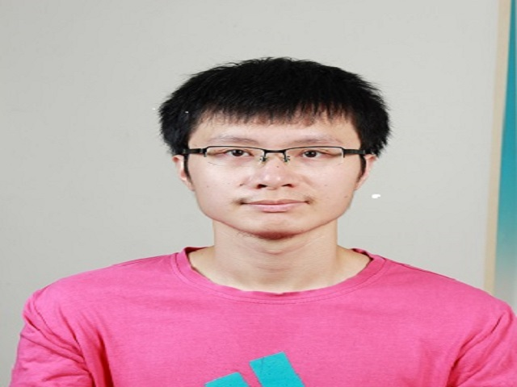

# About Us

We are a team based in the [School of Computing, National University of Singapore](http://www.comp.nus.edu.sg).

## Project Team

#### [Jay Gajendra Kabra](https://github.com/jay500s)
 
**Role**: Developer  
Responsibilities: Model and Code Quality

-----

#### [Tyler Austin Rocha](https://github.com/tylerrocha)
 
Role: Developer  
Responsibilities: Storage, Git Expert

-----

#### [Wu Heyang](https://github.com/whyCaiJi)
 
Role: Developer  
Responsibilities: Logic and Scheduling and Tracking

-----

#### [Yu Cheng-Liang](https://github.com/nuslarry)
 
Role: Developer  
Responsibilities: UI, Testing and Integeration

-----

# Contributors

We welcome contributions. See [Contact Us](ContactUs.md) page for more info.
