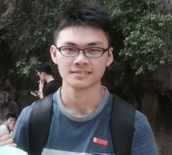
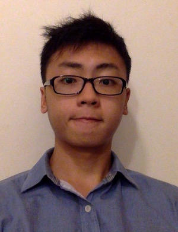

# About Us

We are a team based in the [School of Computing, National University of Singapore](http://www.comp.nus.edu.sg).

## Project Team

#### [Apoorva Ullas](http://github.com/apoorva17)
 
Role: Developer

- Components in charge of: Model
- Aspects/tools in charge of: Travis, Coveralls, Codacy, Code Quality

-----

#### [Chan Yu Feng](http://github.com/fishwind)
 
Role: Developer

- Components in charge of: Logic
- Aspects/tools in charge of: Logic, Natty, CommandParser

-----

#### [Leon Mak](http://github.com/leonmak)
 
Role: Developer

- Components in charge of: UI
- Aspects/tools in charge of: Testing, Integration, Git Expert

-----

#### [Li Heng](https://github.com/Li-Heng-LH)
 
Role: Developer

- Components in charge of: Storage
- Aspects/tools in charge of: Testing, Documentation, Eclipse expert

-----

# Contributors

We welcome contributions. See [Contact Us](ContactUs.md) page for more info.

* [Akshay Narayan](https://github.com/se-edu/addressbook-level4/pulls?q=is%3Apr+author%3Aokkhoy)
* [Sam Yong](https://github.com/se-edu/addressbook-level4/pulls?q=is%3Apr+author%3Amauris)
