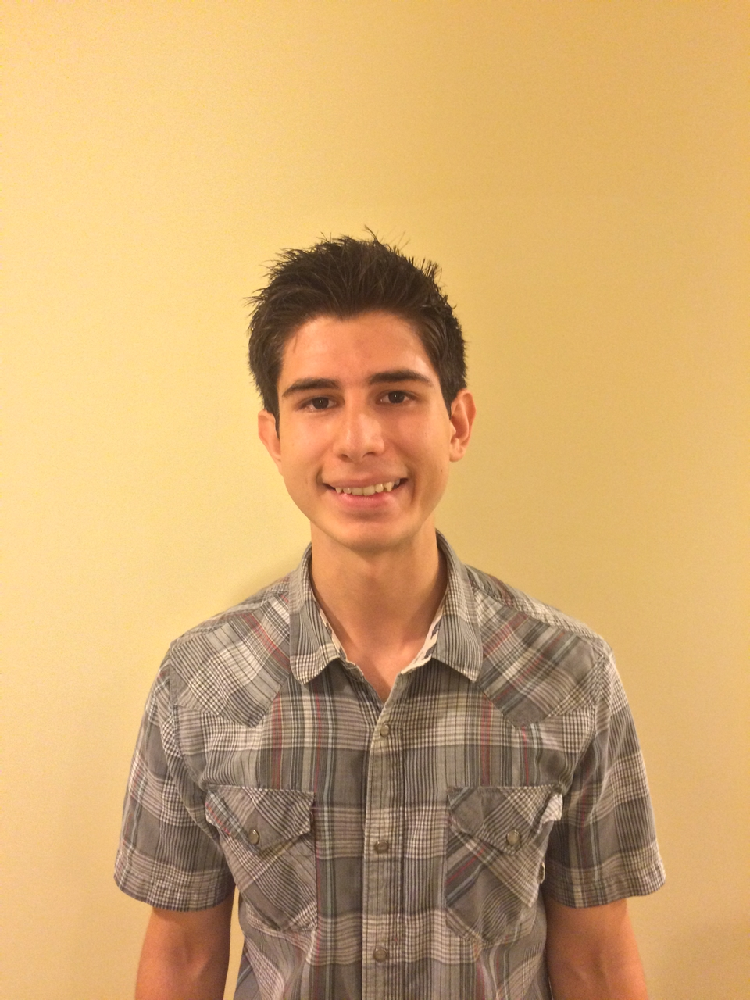

# About Us

We are a team based in the [School of Computing, National University of Singapore](http://www.comp.nus.edu.sg).

## Project Team

#### [Jay Gajendra Kabra](https://github.com/jay500s)
 
*Components in Charge of: [Model](https://github.com/CS2103JAN2017-T11-B3/main/blob/master/docs/DeveloperGuide.md#model-component)  
* Aspects/tools in charge of: Code Quality
* Features implemented:
    * [Reccurring Tasks]()
    * [Find on any parameter](https://github.com/CS2103JAN2017-T11-B3/main/blob/master/docs/UserGuide.md#2.5. Finding all tasks containing any keyword in their name: find)
    * [Prioritize Command Worked with Heyang to implement logic and model functionality](https://github.com/CS2103JAN2017-T11-B3/main/blob/master/docs/UserGuide.md#Allocate priority to a task: prioritize)
* Code written: [[functional code](A0164212U.md)][[test code](A0164212U.md)]
* Other major contributions:
    * Did initial refactoring from AddressBook to TaskList
    * Created Description, Priority, and Timing classes and added respective functionality to validate respective parameters
    * Colored Priorities for better UI experience

-----

#### [Tyler Austin Rocha](https://github.com/tylerrocha)
 
* Components in Charge of: [Storage](https://github.com/CS2103JAN2017-T11-B3/main/blob/master/docs/DeveloperGuide.md#storage-component)  
* Aspects/tools in charge of: Storage, Github repo and webpage
* Features implemented:
    * [Comparable Tasks]()
    * [Save Command]()
    * [Load Command]()
* Code written: [[functional code](A0163559U.md)][[test code](A0163559U.md)]
* Other major contributions:
    * Maintained storage tests, comparable tests
    * Updated testutil files, e.g. TestTask and TaskBuilder
    * Tracked down and fixed general bugs such as null pointer on exit command
    * Maintained git repo, git page; set up Travis, Appveyor, Codacy, Coveralls
    * Provided team assistance with some helpful Eclipse and Sublime Text features

-----

#### [Wu Heyang](https://github.com/whyCaiJi)
 
Role: Developer  
Responsibilities: Logic and Scheduling and Tracking

-----

#### [Yu Cheng-Liang](https://github.com/nuslarry)
 
*Components in Charge of: [UI](https://github.com/CS2103JAN2017-T11-B3/main/blob/master/docs/DeveloperGuide.md#model-component)  
Role: Developer  
Responsibilities: UI, Testing and Integeration
* Features implemented:
    * [Dynamic Calender](images/Ui.png)  :Show all the tasks on the calender accroding to their ending timing
    * Changing Date
    * complete tag coloring
* Other major contributions:
    *fix some guitests,eg: addCommandTest,deleteCommandTest,listCommandTes, to make the task manager pass travis test

-----

# Contributors

We welcome contributions. See [Contact Us](ContactUs.md) page for more info.
