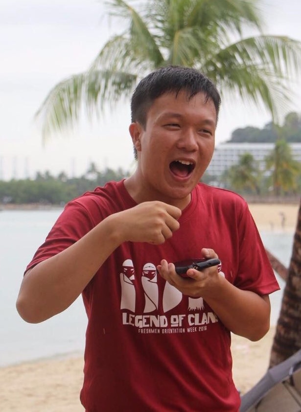
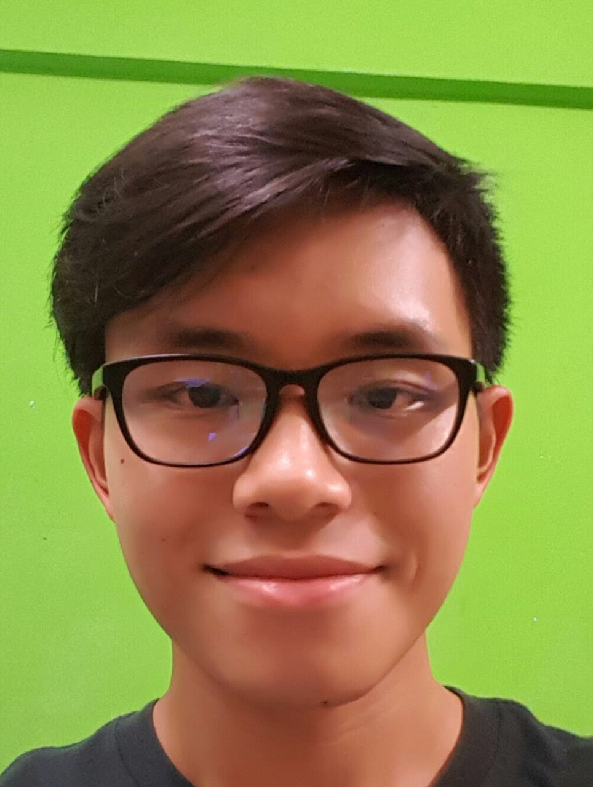

# About Us

We are a team based in the [School of Computing, National University of Singapore](http://www.comp.nus.edu.sg).

## Project Team

#### [Leong Wei Wen](https://github.com/lwwenz)
 
 Role: Developer  
 Responsibilities: Team Leader, Deliverables and deadlines, Integration  
 Component: Storage
 
-----

#### [Dana Baghabrah](http://github.com/danab101)
 
Role: Developer  
Responsibilities: Documentation and Scheduling and tracking  
Component: Model

-----

#### [Francis Cheng](http://github.com/francischeng070)
 
Role: Developer  
Responsibilities: Code quality, Testing and Integration  
Component: Logic  
Features implemented:  
   [Add 3 Type of Task : floating, deadline, event] 
   [Edit name,deadline for 3 Type of Task] 
   [Remove deadline] 
   [Undo Command]  
   [Redo Command]  
   [Flexibility in command] 
Code written: [[functional code](../collated/main/A0139926R.md)][[test code](../collated/test/A0139926R.md]
Other major contributions:
  Did the initial refactoring from AddressBook to TaskManager in main
  Did refractoring from Person to Task in main

-----

#### [Wong Jun Wei](http://github.com/wjunwei94)
 
Role: Developer  
Responsibilities: Documentation and Code quality  
Component: Ui

-----
