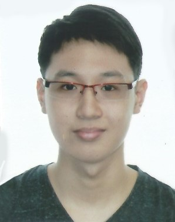

# About Us

We are a team based in the [School of Computing, National University of Singapore](http://www.comp.nus.edu.sg).

## Project Team
#### [Leslie Ho Zong Hong](https://github.com/e0011875)
 
Year 2 Computer Science Major 
**Role**: Team lead  
**Responsibilities**: Deliverables and deadlines, Scheduling and tracking  
* Components in charge of: GUI
* Code written: 
* Contributions:
 * 
 * 
 * 
 
-----

#### [Tan Li Hao](https://github.com/LiHaoTan)
 
Year 2 Computer Science Major 
**Role**: Developer  
**Responsibilities**: Testing, Integration  
* Components in charge of: Logic 
* Code written: 
* Contributions:
 * 
 * 
 * 

-----

#### [Liu Yulin](https://github.com/LiuYulin0629)
 
Year 2 Computer Science Major 
**Role**: Developer  
**Responsibilities**: Code quality  
* Components in charge of: Model, Storage
* Code written: 
* Contributions:
 * 
 * 
 * 

-----
#### [Nirandika Wanigasekara](https://github.com/nirandiw)
 
**Role**: Tutor

-----
