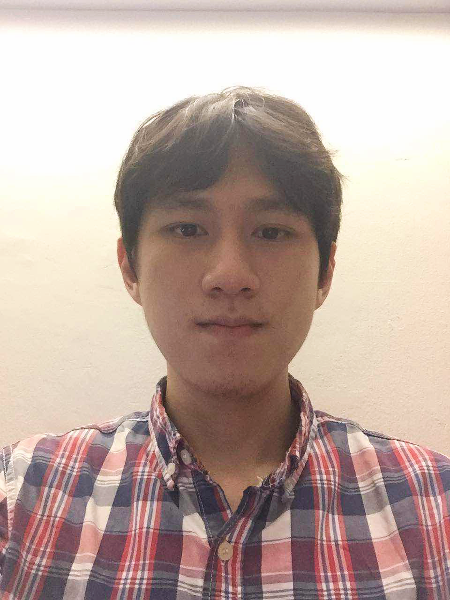

# About Us

We are a team based in the [School of Computing, National University of Singapore](http://www.comp.nus.edu.sg).

## Project Team

#### [Kelly Li](http://github.com/kellyli)
 
 Roles: Deliverables and Deadlines, Scheduling and Task Tracking, GUI Component Lead  
 Responsibilities: Ensure project deliverables are done on time and in the right format. In charge of defining, assigning, and tracking project tasks. Oversees the development of the GUI component.

#### [Joshua Ching](http://github.com/joshuaching)
 
 Roles: Team Lead, Testing Lead, Model Component Lead  
 Responsibilities: Responsible for overall project coordination. Ensures the testing of the project is done properly and on time. Oversees the development of the model component.

#### [Evan Yeung](http://github.com/evanyeung)
 
 Roles: Integration, Code quality, Storage Component Lead  
 Responsibilities: In charge of versioning of the code, maintaining the code repository, integrating various parts of the software to create a whole. Looks after code quality, ensures adherence to coding standards, etc. Oversees the development of the storage component.

#### [Matt Ye](https://github.com/yefenyi)
 
Roles: Documentationem, Git Expert, Eclipse Expert 
Responsibilities: Responsible for the quality of various project documents. Expert in Git and Eclipse.

 -----

# Contributors

We welcome contributions. See [Contact Us](ContactUs.md) page for more info.

* [Akshay Narayan](https://github.com/se-edu/addressbook-level4/pulls?q=is%3Apr+author%3Aokkhoy)
* [Sam Yong](https://github.com/se-edu/addressbook-level4/pulls?q=is%3Apr+author%3Amauris)
