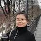

# About Us

We are a team based in the [School of Computing, National University of Singapore](http://www.comp.nus.edu.sg).

## Project Team

#### [Edwin Chan](http://github.com/EdwinChanSingapore) 
 
Role: Team Lead/Developer  
Responsibilities: Integration  
Components in charge of: UI, Logic, Storage

Features implemented:
  * Schedule Command
  * Add Command
  * Undo Command
  * Redo Command

Code written:
  * Functional code
  * Test code
-----

#### [Cheng Yong Quan](http://github.com/riveria94)
 
Role: Developer  
Responsibilities: Integration  
Components in charge of: UI, Logic, Commons, Model

Features implemented:
  * Calendar View
  * Batch Mark Done Command
  * Batch Mark Undone Command
  * Batch Delete Command
  * List Command
  * List by Attribute Command
  
Code written:
  * Functional code
  * Test code
-----

#### [Dion Ng](http://github.com/dionngg)
 
Role: Developer  
Responsibilities: Testing 
Components in charge of: Model, Storage, Logic

Features implemented:
  * Mark Done Command
  * Mark Undone Command
  * Clear Done Command
  * Change Save Location Command
  
Code written:
  * Functional code
  * Test code
-----

#### [Mengci Wu](http://github.com/wmc0098)
 
Role: Developer  
Responsibilities: Code Quality and Documentation 
Components in charge of: Logic, Commons, Model

Features implemented:
  * Date/Time Natural Language Processor
  * Edit Command
  * Recurring 

Code written:
  * Functional code
  * Test code

-----
