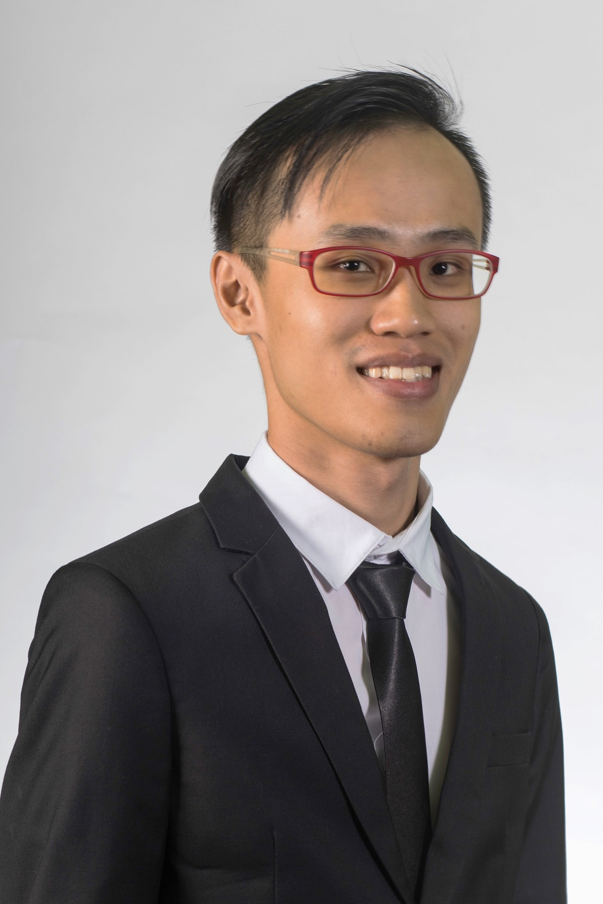

# About Us

We are a team based in the [School of Computing, National University of Singapore](http://www.comp.nus.edu.sg).

## Project Team

#### [Joseph Tang](http://www.comp.nus.edu.sg/~damithch)  
 
Role: Developer  
Responsibilities: Team Lead, Version Control

-----

#### [Loh Zi Bin, Robin](http://github.com/robinloh)
 
Role: Developer  
Responsibilities: Deliverables and Deadlines, Scheduling and Tracking

-----

#### [Chen Zhi Liang](http://github.com/chenzhiliang94)
 

* Components in charge of: [Model](https://github.com/CS2103JAN2017-W14-B4/main/tree/master/src/main/java/seedu/ezdo/model)
* Aspects/tools in charge of: Testing, Task comparision and searching
* Features implemented:
   * [Done task index](https://github.com/CS2103JAN2017-W14-B4/main/blob/master/docs/UserGuide.md#3-marking-a-task-as-done-done--d)
   * [Delete person](https://github.com/CS2103JAN2017-W14-B4/main/blob/master/docs/UserGuide.md#6-finding-tasks-find--f)
* Code written: [[functional code](A0141010L.md)][[test code](A0141010L.md)]
* Other major contributions:
  * Did the initial refactoring of Person's Email to Task's Priority
  * In charge of debugging and brainstorming of ideas
  
Role: Developer  
Responsibilities: Algorithm related code, Integration

-----

#### [Lok You Tan](http://github.com/e0003133)
 
Role: Developer  
Responsibilities: Documentation, Testing

 -----
