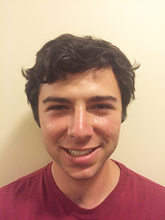
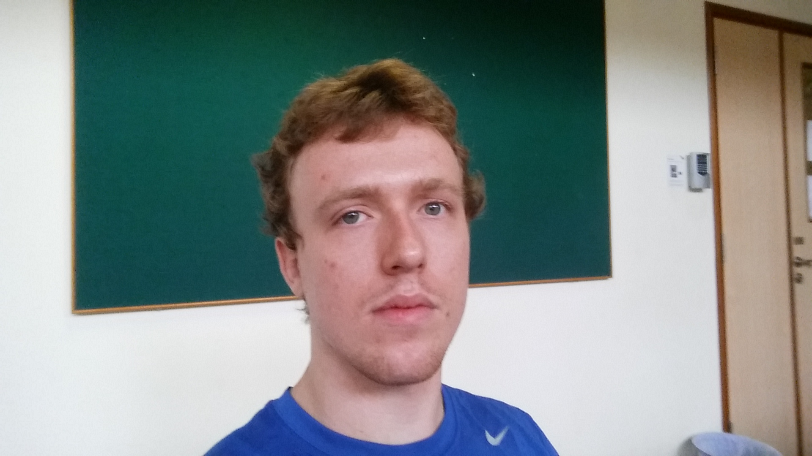
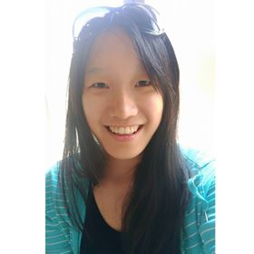

# About Us

We are a team based in the [School of Computing, National University of Singapore](http://www.comp.nus.edu.sg).

## Project Team

#### [Jacob Levy](http://github.com/levyjr)  
 
Role: Developer  
Responsibilities: Documentation, Deliverables and Deadlines, Scheduling and tracking

-----

#### [Daniel Mullen](http://github.com/DanielMullen3)
 
Role: Developer  
Responsibilities: Testing, Back End

-----

#### [Edwin Yeap](http://github.com/edwinyeap)
 
Role: Developer  
Responsibilities: UI, Integration of Version Control 

-----

#### [Yunchun Liu](http://github.com/yunchun-liu)
 
Role: Developer  
Responsibilities: Front end, Testing 

-----

# Source

The source of this project derives from a sample project created by SE-EDU initiative at https://github.com/se-edu/
