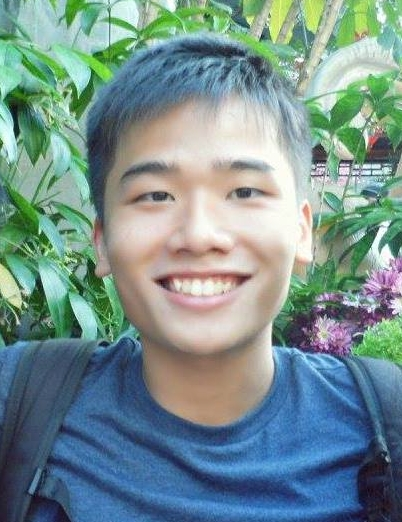
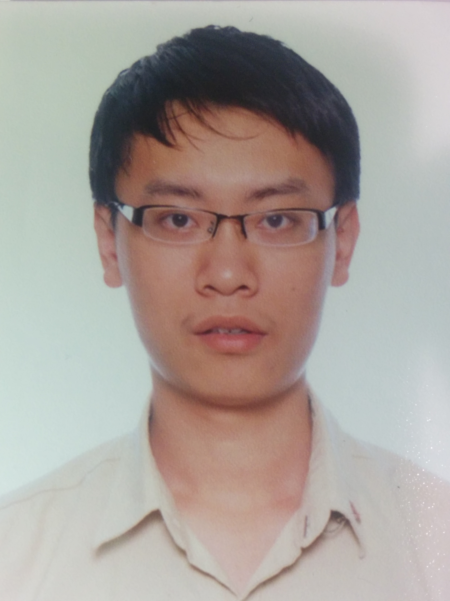

# About Us

We are an amazing team based in the [School of Computing, National University of Singapore](http://www.comp.nus.edu.sg).

## Project Team

#### [Zhan Yuli](https://github.com/senyuuri)  
 
**Role**: Team Lead & Developer  
Responsibilities: UI, deliverables, deadlines, GUI and event

-----

#### [Ken Oung Yong Quan](https://github.com/kenoung)
 
Role: Developer  
Responsibilities: Storage, documentation,

-----

#### [Tham Shi Yuan](http://github.com/thamsy)
 
Role: Developer  
Responsibilities: Logic, code quality, integration

-----

#### [Cao Wei](https://github.com/LoneGunman001)
 
Role: Developer  
Responsibilities: Model, testing, scheduling, tracking and diagrams

-----
