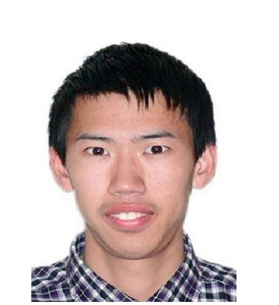

# About Us

Hello from the developers of Watodo! We are an international software engineering team from 3 countries: China, Singapore and Turkey. We are a team based in the [School of Computing, National University of Singapore](http://www.comp.nus.edu.sg).

## Project Team

#### [He Xing Darius](https://github.com/hesingon)  
 
Role: Team Lead, Deliverables and deadlines, Developer

-----

#### [Li Wentong](http://github.com/Wentong-DST)  
 
Role: Developer, Integration, Scheduling and tracking, Final version software, some documentation  
-----

#### [Oguz Yuksek](http://github.com/yuksek)  
 
Role: Developer, Integration, Scheduling and tracking, Final version software, some documentation  

-----

#### [Lin Minhui](http://github.com/lmh1234)  
 
Role: Developer 
