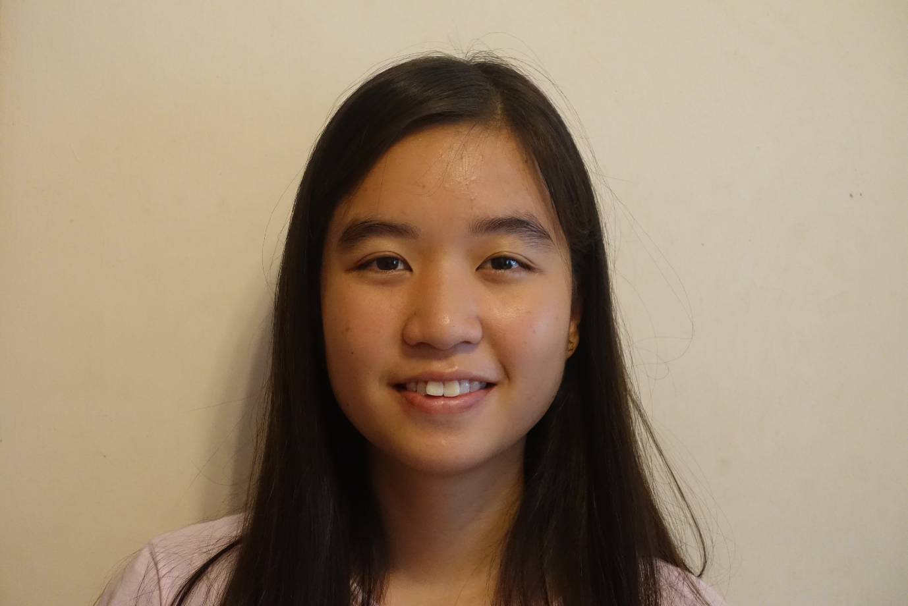

# About Us

We are a team based in the [School of Computing, National University of Singapore](http://www.comp.nus.edu.sg).

## Project Team

#### [Andrew Sugiarto](https://github.com/azraelos)  
 
* **Role:** UI  
* **Responsibilities:** Code quality  
* **Features implemented:**  
* **Code written:**  
* **Other major contributions:**  

-----

#### [Ching Hui Qi](http://github.com/hqching)
 
* **Role:** Logic  
* **Responsibilities:** Scheduling and tracking  
* **Features implemented:**  
* **Code written:**  
* **Other major contributions:**  

-----

#### [Megan Quek](http://github.com/megan-quek)
 
* **Role:** Storage  
* **Responsibilities:** Testing, Documentation  
* **Features implemented:**  
* **Code written:**  
* **Other major contributions:**  

-----

#### [Mervyn Yee](http://github.com/mervynyeezl)
 
* **Role:** Model  
* **Responsibilities:** Team lead, Deliverables and deadlines, Integration  
* **Features implemented:**  
* **Code written:**  
* **Other major contributions:**  

-----

# Other Major Contributors
#### [Henry Chia](http://github.com/hwkchia)
Role: Lecturer  

-----

#### [Soo Yuen Jien](http://github.com/sooyj)
Role: Lecturer and tutor  

-----

#### [Akshay Narayan](http://github.com/okkhoy)
Role: Tutor  

-----

#### [Brandon Yeo](http://github.com/brandonyeoxg)
Role: Tutor  

-----

#### [Joel Tan](http://github.com/JoelT-92)
Role: Tutor  

-----

# Contributors

We welcome contributions. See [Contact Us](ContactUs.md) page for more info.

* [Akshay Narayan](https://github.com/se-edu/addressbook-level4/pulls?q=is%3Apr+author%3Aokkhoy)
* [Sam Yong](https://github.com/se-edu/addressbook-level4/pulls?q=is%3Apr+author%3Amauris)
