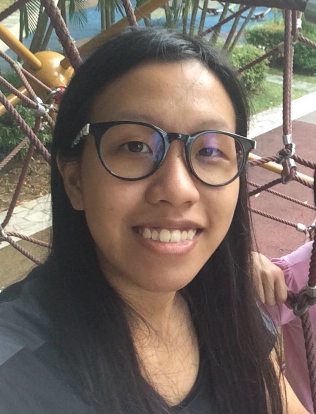
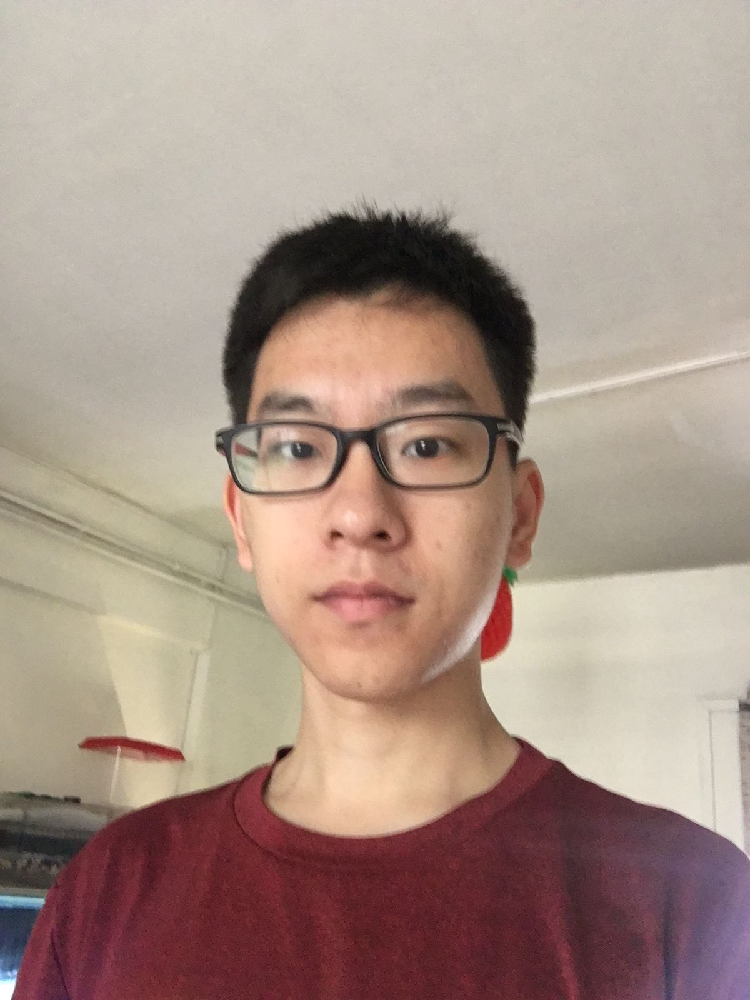

# About Us

We are a team based in the [School of Computing, National University of Singapore](http://www.comp.nus.edu.sg).

##### Work in progress

## Project Team W14-B1

-----

#### [Ellango Vesali](http://github.com/vesaliE)
 
Role: Developer  
Responsibilities: Deliverables and deadlines 
Component in charge of: [Storage] (https://github.com/CS2103JAN2017-W14-B1/main/blob/master/docs/DeveloperGuide.md#25-storage-component) 

Features implemented:

-----

#### [Lim Jie](http://github.com/limjie)
 
Role: Developer  
Responsibilities: Testing 
Component in charge of: [UI] (https://github.com/CS2103JAN2017-W14-B1/main/blob/master/docs/DeveloperGuide.md#22-ui-component) 

Features implemented:

-----

#### [Sherina Toh Shi Pei](http://github.com/sherinatoh)
 
Role: Developer  
Responsibilities: Scheduling and tracking  
Component in charge of: [Logic] (https://github.com/CS2103JAN2017-W14-B1/main/blob/master/docs/DeveloperGuide.md#23-logic-component) 

Features implemented:

-----

#### [Wang Pengcheng](https://github.com/peng229)
 
Role: Developer  
Responsibilities: Integration 
Component in charge of: [Model] (https://github.com/CS2103JAN2017-W14-B1/main/blob/master/docs/DeveloperGuide.md#24-model-component) 

Features implemented:

 -----

 -----

