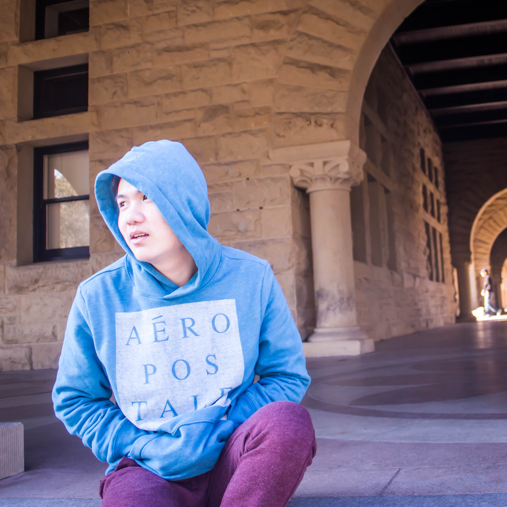

# About Us

We are a team based in the [School of Computing, National University of Singapore](http://www.comp.nus.edu.sg).

## Project Team

#### [Xu Bili](http://github.com/xbili)
 
**Role**: Team lead 
**Responsibilities**: UI

#### [Shi Yanzhang](http://github.com/mynameisyz)
 
**Role**: Testing & QA 
**Responsibilities**: Storage

#### [Lam Guang Jun](http://github.com/gjlam95)
 
**Role**: Ensures code quality 
**Responsibilities**: Logic

#### [Han Lynn](http://github.com/hlynn93)
 
**Role**: Integration & architecture 
**Responsibilities**: Model

