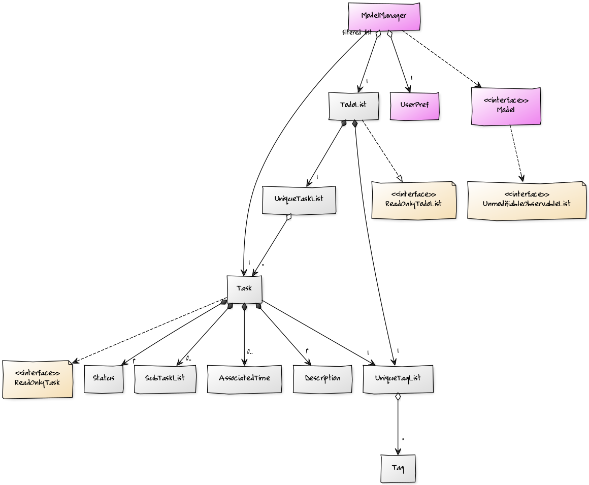

# Tool

[yuml.me](https://yuml.me/diagram/scruffy/class/draw) seems good for quick generation of class diagram

Check out their [examples](https://yuml.me/diagram/scruffy/class/samples) to understand how to create class diagrams


After finishing the design, paste its code from [yuml.me](https://yuml.me/diagram/scruffy/class/draw) into this doc and make new commit so that others can quickly generate, review and edit the proposed design.

# Code Design

## Model


```
// Mock up Model Class Diagram
[<<interface>> Model{bg:violet}]->[note:<<interface>> UnmodifiableObservableList{bg:wheat}]
[ModelManager{bg:violet}]->[note:<<interface>> Model]
[ModelManager]<>-1>[TodoList]
[ModelManager]<>-1>[UserPref{bg:violet}]
[ModelManager]filtered list-1>[Task]
[TodoList]-^[note:<<interface>> ReadOnlyTodoList{bg:wheat}]
[TodoList]++-1>[UniqueTaskList]
[TodoList]++-1>[UniqueTagList]
[UniqueTagList]<>-*>[Tag]
[UniqueTaskList]<>-*>[Task]
[Task]-1>[UniqueTagList]
[Task]++-1*>[Description]
[Task]++-0..>[AssociatedTime]
[Task]++-0..>[SubTaskList]
[Task]++-1*>[Status]
[Task]->[note:<<interface>> ReadOnlyTask{bg:wheat}]
```


