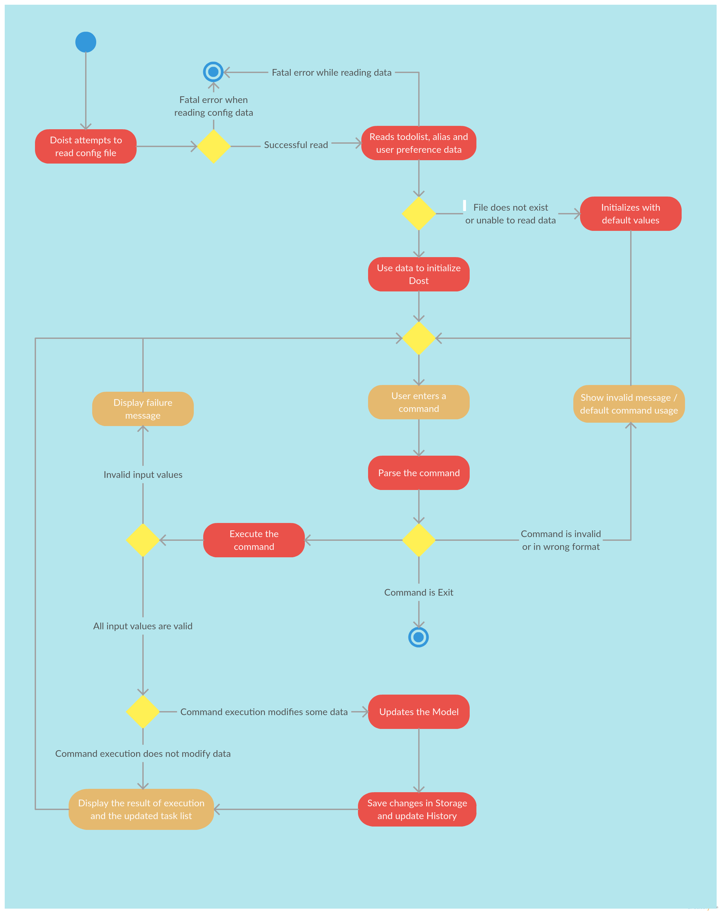
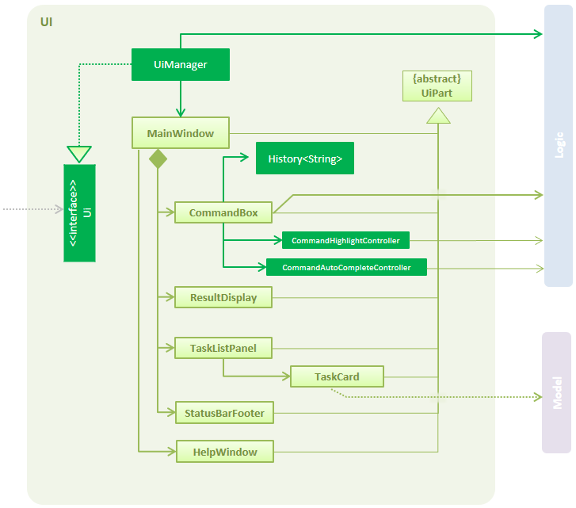

# Doist - Developer Guide

By : `W13-B4`  &nbsp;&nbsp;&nbsp;&nbsp; Since: `Jan 2017`  &nbsp;&nbsp;&nbsp;&nbsp; Licence: `MIT`

---

<br>


## Table of contents

1. [Introduction](#1-introduction)
2. [Setting Up](#2-setting-up)
3. [Design](#3-design)
4. [Implementation](#4-implementation)
5. [Testing](#5-testing)
6. [Dev Ops](#6-dev-ops)
- [Appendix A: User Stories](#appendix-a--user-stories)
- [Appendix B: Use Cases](#appendix-b--use-cases)
- [Appendix C: Non Functional Requirements](#appendix-c--non-functional-requirements)
- [Appendix D: Glossary](#appendix-d--glossary)
- [Appendix E : Product Survey](#appendix-e--product-survey)

<br>


## 1. Introduction
<p>Doist is a task manager that aims to simplify the lives of busy users! It is a desktop Java application that facilitates command line input to keep track of users' everyday tasks.</p>
<p>This developer guide aims to give developers a nuts and bolts insight into Doist, and to also encourage contribution to the development of this application.</p>


<br>


## 2. Setting up

### 2.1. Prerequisites

1. **JDK `1.8.0_60`**  or later<br>

    > This app will not work with earlier versions of Java 8.

2. **Eclipse** IDE
3. **e(fx)clipse** plugin for Eclipse (Follow the instructions given at
   [this page](http://www.eclipse.org/efxclipse/install.html#for-the-ambitious))
4. **Buildship Gradle Integration** plugin from the Eclipse Marketplace
5. **Checkstyle Plug-in** plugin from the Eclipse Marketplace


### 2.2. Importing the project into Eclipse

1. Fork this repo, and clone the fork to your computer
2. Open Eclipse (Note: Ensure you have installed the **e(fx)clipse** and **buildship** plugins as given
   in the prerequisites above)
3. Click `File` > `Import`
4. Click `Gradle` > `Gradle Project` > `Next` > `Next`
5. Click `Browse`, then locate the project's directory
6. Click `Finish`

  > * If you are asked whether to 'keep' or 'overwrite' config files, choose to 'keep'.
  > * Depending on your connection speed and server load, it can even take up to 30 minutes for the set up to finish
      (This is because Gradle downloads library files from servers during the project set up process)
  > * If Eclipse auto-changed any settings files during the import process, you can discard those changes.


### 2.3. Troubleshooting project setup

* **Problem**: Eclipse reports compile errors after new commits are pulled from Git
    - *Reason*: Eclipse fails to recognize new files that appeared due to the Git pull.
    - *Solution*: Refresh the project in Eclipse:
  Right click on the project (in Eclipse package explorer), choose `Gradle` -> `Refresh Gradle Project`.

* **Problem**: Eclipse reports some required libraries missing
    - *Reason*: Required libraries may not have been downloaded during the project import.
    - *Solution*: [Run tests using Gradle](UsingGradle.md) once (to refresh the libraries).

<br>


## 3. Design

### 3.1. Architecture

<br>
_Figure 3.1.1 : Architecture Diagram_

The **_Architecture Diagram_** given above explains the high-level design of Doist. Each of the components illustrated pertain to a specfic aspect of the App, and are briefly discussed below.

#### `Main`
The `Main` component is the heart of the App. It is responsible for
- initializing other components (`Model`, `Logic`, `UI`) in the correct order and loading data from local storage when the app launches.  
- terminating other components when Doist is shut down.

#### [`UI`](#2-ui-component)
The `UI` component serves as the eyes and ears of the App. It handles all user interactions, as well as displaying information to the user.

#### [`Logic`](#3-logic-component)
The `Logic` component is the brains behind the App. It takes charge of parsing the user input and executing the commands.

#### [`Model`](#4-model-component)
The `Model` component is the spine around which the App has been built. It represents the data that Doist operates on and also supports the operations on the same.

#### [`Storage`](#5-storage-component)
The `Storage` component handles the App's memory. It takes charge of reading data from, and writing data to, the hard disk.

#### `Commons`
The `Commons` component is akin to the nervous system of the App. It contains a collection of classes used by multiple other components. The following are 2 representatives.
- EventsCenter : supports the communication among different components using events
- LogsCenter : enables writing log messages to the log file.

#### Events-Driven nature of the design

The _Sequence Diagram_ below shows how the components interact for the scenario where the user issues the
command `delete 1`.

<br>
_Figure 3.1.2a : Component interactions for `delete 1` command (part 1)_

>Note how the `Model` simply raises a `TodoListChangedEvent` when the TodoList data are changed,
 instead of asking the `Storage` to save the updates to the hard disk.

The `EventCenter` is a Singleton class. Its instance can be accessed using the `EventsCenter.getInstance()` method. <br>
The diagram below shows how the `EventsCenter` reacts to the `TodoListChangedEvent` event, which eventually results in the updates
being saved to the hard disk and the status bar of the UI being updated to reflect the 'Last Updated' time. <br>

<br>
_Figure 3.1.2b : Component interactions for `delete 1` command (part 2)_

> Note how the event is propagated through the `EventsCenter` to the `Storage` and `UI` without `Model` having
  to be coupled to either of them. This is an example of how this Event Driven approach helps us reduce direct
  coupling between components.

#### Activity Diagram

<br>
_Figure 3.1.3 : ActivityDiagram for Doist_

The above diagram describes the behaviour of Doist. The red boxes represent any actions taken by Doist, and the brown boxes represent activities that include user interactions.

After Doist is launched, it tries to read the config file. In the event that there is an unrecoverable error, the application will close. Upon successful reading of the config file, Doist attempts to load todolist data, alias data and user preferences from the saved files at the location specified by the config file. If no previous saved files are found, Doist will initialize with default values. Doist will then wait for the user to enter a command, and will perform the necessary steps to handle both valid and invalid commands. The `Logic` component takes charge of doing this and updates the `Model` component accordingly. The `UI` component provides any feedback or results to the user.

The sections below give more details of each component.

### 3.2. UI component
The `UI` is the main form of interaction between Doist and the user. This is mainly done using the JavaFX package. `UI` executes commands entered by the user and updates itself to reflect the results of these commands. It works closely with `Logic` component to execute commands, and also responds to events raised internally by Doist. The [FXML files](../src/main/resources/view) contain the descriptions of the user interface that is controlled by the corresponding java class with the same name.

The following diagram represents the structure of the `UI` component:  
<br><br>
_Figure 3.2.1 : UI Component Class Diagram_

Here are some of the key files in the `Ui` component:
- [`UI.java`](../src/main/java/seedu/doist/ui/Ui.java):  contains an `interface` that defines two operations that control the UI of the App.
    These operations are defined using different methods (API).  
    Some representative methods are listed here:  
    ```java  
    void start(Stage primaryStage)
    void stop()  
    ```  
- `UiManager.java`: contains a `class` that implements the operations specified in `Ui.java`.
- `MainWindow.java`: contains a `class` that represents the Main Window viewed by the user.
- `CommandBox.java`: contains a `class` that represents the Command Box used by the user to enter commands.

### 3.3. Logic component
The `Logic` component handles the execution of the commands entered by the user. It consists of several subcomponents, most notably the `Parser` and `Command` class. `Logic` also prepares the information to be used by the `UI` to display to the user.

The following diagram represents the structure of the `Logic` component  
<br><br>
_Figure 3.3.1 : Logic Class Diagram_

Here are some of the key files in the `Logic` component:
- [`Logic.java`](../src/main/java/seedu/doist/logic/Logic.java):  contains an `interface` that defines operations to obtain the results of computations.  
    These operations are defined using different methods (API).  
    Some representative methods are listed here:  
    ```java  
    CommandResult execute(String commandText) throws CommandException;
    ObservableList<ReadOnlyTask> getFilteredPersonList();  
    ```  
- `LogicManager.java`: contains a `class` that implements the operations specified in `Model.java`.
- `Parser.java`: contains a `class` that is in charge of parsing commands.
- `Command.java`: contains a `class` that represents each command defined in Doist.

Given below is the Sequence Diagram for interactions within the `Logic` component for the `execute("delete 1")`
 API call.<br>
<br>
_Figure 3.3.2 : Interactions Inside the Logic Component for the `delete 1` Command_

### 3.4. Model component
The `Model` component defines classes that represent the data Doist operates on. It also specifies and implements operations that work on the data.  

The following diagram represents the structure of the `Model` component  
<br>  
_Figure 3.4.1 : Model Class Diagram_

Here are some of the key files in the `Model` component:
- [`Model.java`](../src/main/java/seedu/doist/model/Model.java):  contains an `interface` that defines multiple operations on the todolist data.  
    These operations are defined using different methods (API).  
    Some representative methods are listed here:  
    ```java  
    void finishTask(ReadOnlyTask target) throws UniqueTaskList.TaskNotFoundException, UniqueTaskList.TaskAlreadyFinishedException;
    void addTask(Task task) throws UniqueTaskList.DuplicateTaskException;
    void deleteTask(ReadOnlyTask target) throws UniqueTaskList.TaskNotFoundException;  
    ```  
- `AliasListMapModel.java`: contains an `interface` that defines multiple operations on the aliaslistmap data.  
Some representative methods are listed here:  
```java  
ReadOnlyAliasListMap getAliasListMap();
void setAlias(String alias, String commandWord);
List<String> getValidCommandList(String defaultCommandWord);
void removeAlias(String alias);
```  
- `ConfigModel.java`: contains an `interface` that defines operations on the config file.   
- `ModelManager.java`: contains a `class` that implements the operations specified in `Model.java`.
- `AliasListMapManager.java`: contains a `class` that implements the operations specified in `AliasListMapModel.java`.
- `ConfigManager.java`: contains a `class` that implements the operations specified in `ConfigModel.java`.
- `TodoList.java`: contains a `class` that represents the to-do list.
- `Task.java`: contains a `class` that represents each to-do list item (i.e. task).
- `UserPrefs.java`: contains a class that stores user preferences such as the position and size of the app window.

**Design Decisions**
- The model component is split into Model.java, AliasListMapModel.java and ConfigModel.java because they contain operations on different types of data. This is to support the Single Responsibility Principle.
- When the absolute storage path is modified by the `save_at` command, an `AbsoluteStoragePathChangedEvent` is raised by `Model`. This event driven mechanism employs the Observer pattern.

### 3.5. Storage component
The `Storage` component takes charge of reading and writing (R/W) data, to and from the hard drive.
This data consists of **user preferences**, **to-do list** and **alias list map**:
- **user preferences** is stored in a **JSON** file.
- **to-do list** is stored in a **XML** file.
- **alias list map** is stored in another **XML** file

The following diagram represents the structure of the `Storage` component  
<br><br>  

Here are some of the key files in the `Storage` component:
- [`Storage.java`](../src/main/java/seedu/doist/storage/StorageManager.java):  contains an `interface` that defines R/W operations on **user preferences**, **to-do list** and **alias list map**.  
    These operations are defined using different methods (API).  
    Some representative methods are listed here:  
    ```java  
    Optional<UserPrefs> readUserPrefs() throws DataConversionException, IOException;
    void saveUserPrefs(UserPrefs userPrefs) throws IOException;
    Optional<ReadOnlyTodoList> readTodoList() throws DataConversionException, IOException;
    void saveTodoList(ReadOnlyTodoList todoList) throws IOException;  
    ```  
- `StorageManager.java`: contains a `class` that implements the operations specified in `Storage.java`. <br>
- `TodoListStorage.java`: contains an `interface` that defines R/W operations on **to-do list**.
- `AliasListMapStorage.java`: contains an `interface` that defines R/W operations on **alias list map**. <br>
- `XmlTodoListStorage`: contains a `class` that implements the R/W operations specified in `TodoListStorage.java`. An instance of this class is utilized in `StorageManager`.
- `XmlAliasListMapStorage`: contains a `class` that implements the R/W operations specified in `AliasListMapStorage.java`. An instance of this class is utilized in `StorageManager`.  
- `JsonUserPrefsStorage`: contains a `class` that implements the R/W operations on **user preferences**. An instance of this class is used in `StorageManager`.

**Design Decisions**
- The storage component is split into `TodoListStorage`, `AliasListMapStorage` and `JsonUserPrefsStorage` because they contain R/W operations on different types of data. This is to support the Single Responsibility Principle.
- `StorageManager` is notified when a `AbsoluteStoragePathChangedEvent`is raised. It will then set the file paths for the three different storages. This event driven mechanism employs the Observer pattern.

<br>


## 4. Implementation

### 4.1. Undo and Redo
Whenever a mutating command, such as `add`, `delete` and `edit`, is executed, the new state of the to-do list will be stored into history.
> Note: Although `undo` and `redo` should also be considered as mutating commands, they will not trigger the new state of the to-do list to be stored into history.

`undo` and `redo` are implemented by navigating through the to-do list history as mentioned above.  
To be more specific, the to-do list history is represented by 2 stacks of `TodoList` objects, as implemented in this file: [`History.java`](#../src/main/java/seedu/doist/commons/util/History.java).

> Remark: There are 2 common ways to implement undo and redo feature: `saving states (what we are doing)` and `generating state (saving commands)`. There are 2 reasons why we chose the first implementation:
> 1. If we save the commands instead, we have to implement a reverse / undo method for each command, which will be time-consuming due to the complexity of the commands.
> 2. When we copy the `TodoList` object, the constituent `Task` objects will not be copied. Thus, only new references will be created and this is less memory-intensive compared to creating a deep copy of all the `Task` objects.

### 4.2. Logging

We are using `java.util.logging` package for logging. The `LogsCenter` class is used to manage the logging levels and logging destinations.

* The logging level can be controlled using the `logLevel` setting in the configuration file
  (See [Configuration](#configuration))
* The `Logger` for a class can be obtained using `LogsCenter.getLogger(Class)` which will log messages according to
  the specified logging level
* Currently log messages are output through: `Console` and to a `.log` file.

#### Logging Levels

* `SEVERE` : Critical problem detected which may possibly cause the termination of the application
* `WARNING` : Can continue, but with caution
* `INFO` : Information showing the noteworthy actions by the App
* `FINE` : Details that is not usually noteworthy but may be useful in debugging
  e.g. print the actual list instead of just its size

### 4.3. Configuration

Certain properties of the application can be controlled (e.g App name, logging level) through the configuration file
(default: `config.json`):

<br>


## 5. Testing

Tests can be found in the `./src/test/java` folder.

### 5.1. Types of tests

#### 5.1.1. GUI Tests
These are _System Tests_ that test the entire App by simulating user actions on the GUI.
   These are in the `guitests` package.
> ##### *Headless GUI Testing*
> Thanks to the [TestFX](https://github.com/TestFX/TestFX) library we use,
 our GUI tests can be run in the _headless_ mode.
 In the headless mode, GUI tests do not show up on the screen.
 That means the developer can do other things on the Computer while the tests are running.
 See [UsingGradle.md](UsingGradle.md#running-tests) to learn how to run tests in headless mode.

#### 5.1.2. Non-GUI Tests
These are tests not involving the GUI. They include,
   1. _Unit tests_ targeting the lowest level methods/classes. <br>
      e.g. `seedu.address.commons.UrlUtilTest`
   2. _Integration tests_ that are checking the integration of multiple code units
     (those code units are assumed to be working).<br>
      e.g. `seedu.address.storage.StorageManagerTest`
   3. Hybrids of unit and integration tests. These test are checking multiple code units as well as
      how the are connected together.<br>
      e.g. `seedu.address.logic.LogicManagerTest`

### 5.2. How to test
#### 5.2.1. In Eclipse

* To run all tests, right-click on the `src/test/java` folder and choose
  `Run As` > `JUnit Test`
* To run a subset of tests, you can right-click on a test package, test class, or a test and choose to run as a JUnit test.

#### 5.2.2. Using Gradle

* See [UsingGradle.md](UsingGradle.md) for how to run tests using Gradle.


### 5.3. Troubleshooting tests
 - **Problem**: Tests fail because NullPointException when AssertionError is expected  
    - *Reason*: Assertions are not enabled for JUnit tests.
   This can happen if you are not using a recent Eclipse version (i.e. _Neon_ or later)  
    - *Solution*: Enable assertions in JUnit tests as described [here](http://stackoverflow.com/questions/2522897/eclipse-junit-ea-vm-option).  
    Delete run configurations created when you ran tests earlier.

<br>


## 6. Dev Ops

### 6.1. Build Automation

You can learn how to use Gradle for build automation from [UsingGradle.md](UsingGradle.md).

### 6.2. Continuous Integration

We use [Travis CI](https://travis-ci.org/) and [AppVeyor](https://www.appveyor.com/) to perform _Continuous Integration_ on our projects.
You can read [UsingTravis.md](UsingTravis.md) and [UsingAppVeyor.md](UsingAppVeyor.md) for more details.

### 6.3. Publishing Documentation

You can learn how to use GitHub Pages to publish documentation to the project site from [UsingGithubPages.md](UsingGithubPages.md).

### 6.4. Making a Release

Here are the steps to create a new release.

 1. Generate a JAR file [using Gradle](UsingGradle.md#creating-the-jar-file).
 2. Tag the repo with the version number. e.g. `v0.1`
 2. [Create a new release using GitHub](https://help.github.com/articles/creating-releases/) and upload the JAR file you created.

### 6.5. Managing Dependencies

Doist depends on third-party libraries, such as [Jackson library](http://wiki.fasterxml.com/JacksonHome) for XML parsing, [Natty](http://natty.joestelmach.com) for date and time parsing.  
Managing these _dependencies_ has been automated using Gradle. Gradle can download the dependencies automatically, which is better than these alternatives.Therefore, there is no need to include those libraries in the repo, which will bloat the repo size, or download those libraries manually, which reates extra work for developers. To add new 3-party libraries, update `build.gradle`.

<br>


## Appendix A : User Stories

Priorities: High (must have) - `* * *`, Medium (nice to have)  - `* *`,  Low (unlikely to have) - `*`

Priority | As a ... | I want to ... |So that I can ...
-------- | :------- | :------------ | :-----------
**`* * *`** | user | create a new task with a optional start time, end time and other properties | create an priortised event, deadline or a floating task that might be recurring
**`* * *`** | user | view the details of a task | see details of a task such as recurrance interval
**`* * *`** | user | see a list of pending, overdue or finished tasks separately
**`* * *`** | user | edit task properties
**`* * *`** | user | mark a task as "Finished"
**`* * *`** | user with many tasks |  find tasks using keywords (appearing in titles or in description) | easily find the task
**`* * *`** | user | view all commands that I can use with detailed instructions, including examples
**`* * *`** | user that makes mistakes | undo my last action(s) | revert to the previous state
**`* * *`** | user | delete multiple tasks at the same time by their indices
**`* * *`** | user | change the storage directory (path) | decide where the storage file will be saved
**`* *`** | user | delete all tasks listed under a tag
**`* *`** | user | create or delete a new tag
**`* *`** | user | add or delete tags for a specific task | better filter the tasks
**`* *`** | user | see a list of tasks within a specified time interval
**`* *`** | user | see a list of all tasks with a specific tag | filter tasks by tag
**`* *`** | user | recover a certain task in the "Trash Bin"
**`* *`** | user | use arrow key to see the previous commands I execute | re-execute the past commands conveniently without manually typing them
**`* *`** | user | see an error message to appear at the feedback textbox | figure out what error occured
**`*`** | user | rename existing commands | customise to the ones I am more used to
**`*`** | user | reset all changes to existing commands | return to using the default commands
**`*`** | user | see keywords in the command being highlighted
**`*`** | user | type with auto-completion / content-assistant of the keywords
**`*`** | user | create a new task by entering the date in a "natural language" way | it feels more natural when typing
**`*`** | user | see my "Trash Bin" that consists of deleted tasks | view and/or recover them
**`*`** | user | see my tasks on Google Calendar | integrate tasks with Google Calendar

<br>


## Appendix B : Use Cases

(For all use cases below, the System is Doist and the Actor is the user, unless specified otherwise)

### Use Case: Add a new task

**MSS**

1. User types in the command for adding a new task and specifies the parameters
2. Doist adds a new task, and displays a success message

Use case ends

**Extensions**

2a. The command format is invalid

>2a1. Doist shows an error message
>Use case ends

2b. The given input is invalid

> 2b1. Doist shows an error message
  Use case ends

### Use Case: List all tasks

**MSS**

1. User types in the command to list tasks
2. Doist list tasks, and displays a success message

Use case ends.

**Extensions**

2a. The command format is invalid

>2a1. Doist shows an error message
>Use case ends

2b. There are no tasks currently stored

> 2b1. Doist shows an appropriate message
  Use case ends


### Use Case: Edit an existing task

**MSS**

1. User types in the command to edit a task
2. Doist updates the task, and displays a success message

Use case ends.

**Extensions**

2a. The command format is invalid

>2a1. Doist shows an error message
>Use case ends

2b. The task does not exist

> 2b1. Doist shows an appropriate message
> Use case ends

2c. The new properties are invalid
> 2c1. Doist shows and appropriate message
> Use case ends

### Use Case: Delete tasks

**MSS**

1. User types in the command to delete tasks
2. Doist deletes the specified tasks, and displays a success message

Use case ends.

**Extensions**

2a. The command format is invalid

>2a1. Doist shows an error message
>Use case ends

2b. The task does not exist

> 2b1. Doist shows an appropriate message
> Use case ends

### Use Case: Undo a command

**MSS**

1. User types in the command or press `Ctrl+z` to undo the previous mutating command
2. Doist performs the undo operation, and displays a success message

Use case ends.

**Extensions**

2a. The command format is invalid

>2a1. Doist shows an error message
>Use case ends

2b. There is no previous mutating command

> 2b1. Doist shows an appropriate message
> Use case ends

### Use Case: Mark tasks as finished

**MSS**

1. User types in the command to mark tasks as finished
2. Doist marks the specified tasks as finished, and displays a success message

Use case ends.

**Extensions**

2a. The command format is invalid

>2a1. Doist shows an error message
>Use case ends

2b. Task is already finished

> 2b1. Doist shows an appropriate message
> Use case ends

### Use Case: Find a task

**MSS**

1. User types in the command to find a task
2. Doist shows the task, and displays a success message

Use case ends.

**Extensions**

2a. The command format is invalid

>2a1. Doist shows an error message
>Use case ends

2b. The task does not exist

> 2b1. Doist shows an appropriate message
> Use case ends

2c. There are multiple potential matches

>2c1. Show all possible matches
>Use case ends

### Use Case: Change data storage location

**MSS**

1. User types in the command to change data storage location to a certain folder
2. Doist changes the storage location and displays a success message

Use case ends.

**Extensions**

2a. The command format is invalid

>2a1. Doist shows an error message
>Use case ends

2b. The specified file path is invalid

> 2b1. Doist shows an appropriate message
> Use case ends

2c. There already exists a file (not a folder) with the same name at that path

> 2b1. Doist shows an appropriate message
> Use case ends

<br>


## Appendix C : Non Functional Requirements

- The project should work on any mainstream OS as long as it has Java 8 or higher installed
- It is a desktop app
- Have multiple UI themes
- Come with automated unit tests
- Be able to hold up to 1000 tasks
- Run fast enough by responding to a user's command on the command line interface within 5 secs
- Be open source
- Have flexible commands that accept variations
- Allow user to customise default commands
- Show tags and priority of tasks in a user-friendly, obvious way
- Allow user to change storage folder directory
- Mouse actions should have keyboard alternatives and typing is preferred over key combinations. Command-line is the best choice of input
- Commands should be easy to learn.
- The data should be stored locally in the form of a human editable text file
- The software should work without requiring an installer
- Can have tasks across days, weeks, months, years, centuries...

See the rest of the NFRs at:
http://www.comp.nus.edu.sg/~cs2103/AY1617S2/contents/handbook.html#handbook-project-constraints

<br>


## Appendix D : Glossary
**Task**
- Properties
    - `Description`
    - `Priority`
    - `Start time` (optional)
    - `End time` (optional)
    - `isFinished` (default false)
    - `Tags` (can be empty)
- About the properties
    - `Priority`
    There are three priorities: High, Medium, Low. By default, tasks are low priority.
    - `Tags`
    Tags are independent of tasks. Tags and tasks have a many-to-many relationship where zero or more tags can be added to a task and zero or more tasks can be listed under a tag
- Special Types
    - `Event`
    A task with different `start time` and `end time`. It represents tasks to be carried out over a period of time
    - `Deadline`
    A task with the same `start time` and `end time`. It represents tasks that have to be done before a specific time
    - `Floating task`
    A task with neither `start time` nor `end time`. It represents tasks that are not associated with any timing. It can only be `pending` and `finished`, never `overdue`
    - `Pending tasks`
    Tasks that have not been `finished` nor `ended`
    - `Overdue tasks`
    Tasks that have `ended` but not been `finished`
    - `Finished tasks`
    Tasks that have been `finished`

**R/W**
    Reading and Writing

**Mutating Command**
    Any command which causes a change in the state of apps (E.g. `add`, `delete`, `finish`)

**Mainstream OS**
    Windows, Linux, Unix, OS-X

<br>


## Appendix E : Product Survey

**Remember the Milk**

Author: Lee Yan Hwa

Pros:

* Almost "natural language" command-line interface to enter tasks
* Neat UI to display tasks and view different types of tasks (Finished, Overdue, Not finished, Due today, Tomorrow, This Week, Trash)
* Tasks are automatically added to Smart Lists according to criterias set by user
* Has subtasks
* Has all the normal features of a task manager such as due-date, mark as finished, notes, priority, different sorting methods, tagging, postponing, recurring tasks
* Able to share tasks and collaborate with others
* Available for use on many different platforms (Mobile, PC)


Cons:

* Some of the best features like subtasks is pro-only
* Doesn't have support for handwritten tasks, drawings, images, calendar view
* Reminder timing cannot be customised
* No attachment of files

**Wunderlist**

Author:  Ram Janarthan

Pros:

* Has a good user interface that feels nice to use
* Can provide context for each tasks, by allowing attachment of files
* Easy sharing for multiple users, supports collaboration very well
* Allows for subtasks, and also reminders for tasks
* Tasks are very user-customisable
* Automatically fixes reminders if it detects dates in the input
* Available for use on many different platforms (Mobile, PC)


Cons:

* Pro version is quite expensive
* There is no dedicated 'Sync' button
* Setup is a bit lengthy, and may require you to download the mobile version as well


**Google tasks**

Author: Yuyang Luo

Pros:

* It is integrated with Google Calendar, so you can check your tasks in the Calendar view
* There is support for groups (assign tasks into groups)
* Users can sort tasks in chronological order


Cons:

* There is no official mobile apps (neither for Android nor iOS)
* Only support plain text
* The webapp UI is not well-designed
* There is no support for labels
* There is no support for task priority in the official webapp (some third-party apps add this feature)
* Almost all the third-party mobile apps are paid
* There is no support for reminder in the official webapp (some third-party apps add this feature)
* Users can only set the deadline, which is a date for the task, cannot set the specific time
* There is no support for searching feature

**Google Keep**

Author: Yuyang Luo

Pros:

* Cross-platform: chrome extension, mobile app for iOS and Android, web app
* The interface are well-designed (similar to sticky notes)
* There is support for labels
* Users can pin certain notes or reminders to be shown at the top
* Can insert images and hand-drawing
* Users can search for notes and reminders


Cons:

* There is no support for priority
* There is no support for sorting (by priority, by deadline)
